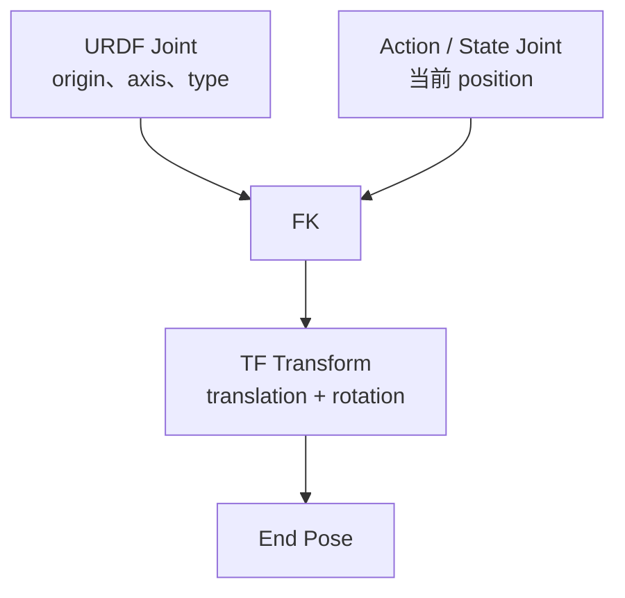
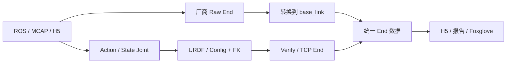

# 机器人位姿、坐标系、URDF 与末端位姿解算入门

> 状态：第一阶段内容底稿  
> 受众：会写代码，但基本不了解 ROS、URDF、TF 和机器人运动学的平台开发人员  
> 目标时长：30 分钟以内  
> 最终载体：Slidev HTML，PDF 作为备用版本  
> 本阶段目标：准备完整文本、讲解顺序、讲稿提示、已有素材引用和待补素材占位，不制作 Slidev 页面

## 1. 分享目标

这是一份面向数采训练场平台开发团队的入门科普，同时提供后续参与 FK 模块开发所需的最低技术基础。

听众在分享结束后，应当能够回答：

1. 一个 pose 为什么必须说明 reference frame？
2. position 和 orientation 分别表达什么？
3. RPY、rotation matrix、quaternion 有什么区别？
4. action end 和 state end 有什么区别？
5. raw end、verify/FK end、reference end 和 TCP end 分别是什么？
6. world、base_link 和厂商自定义 frame 有什么区别？
7. URDF 中的 link、joint、origin、axis 和 mesh 分别是什么？
8. URDF joint、运行时 joint position 和 TF transform 有什么区别？
9. FK 如何沿一条运动链计算 end pose？
10. 开发 FK 时需要检查哪些输入、单位、映射和坐标系问题？
11. 如何通过 Foxglove 对 FK 和末端位姿进行基本校验？

## 2. 正文边界

正文包含：

- Pose、frame、position、orientation 和 timestamp。
- XYZ 轴的常见颜色约定。
- world、base_link 和厂商自定义 frame。
- RPY、rotation matrix 和 quaternion。
- Action/State、Raw/FK、Reference/TCP 三组独立语义。
- URDF 的 link、joint、tree、origin、axis、type、limit。
- Mesh、STL、visual、collision、inertial 和 meshless link。
- URDF joint、运行时 joint 数据和 TF transform 的关系。
- 齐次变换矩阵、单 joint 变换、运动链累积和 FK 伪代码。
- 单帧与批量 FK 的基本实现方式。
- 公司数据中的高层处理流程。
- Raw/Verify 对比、常见错误和基本验证方法。

正文不展开：

- IK、Jacobian、动力学和运动规划。
- RPY、rotation matrix、quaternion 的完整转换推导。
- Rodrigues 公式和 quaternion 乘法推导。
- inertia 矩阵的计算方法。
- TCP 的具体标定方法。
- ROS TF publisher/subscriber API。
- STL 内部二进制格式、网格修复和 CAD 导出流程。
- H5 完整 schema、配置文件完整字段和生产模块实现细节。
- GPU FK、复杂数值优化和机器人运动学库内部实现。

## 3. 时间分配

| 章节 | 时间 | 内容 |
|---|---:|---|
| 为什么需要末端位姿 | 2 分钟 | 末端位姿及公司内用途 |
| Pose、坐标系与姿态 | 5 分钟 | Position、orientation、frame、XYZ 颜色和姿态表达 |
| 末端位姿的类型与来源 | 4 分钟 | Action/State、Raw/FK、Reference/TCP |
| URDF 与机器人结构 | 6 分钟 | Link、joint、tree、mesh/STL、真实 joint |
| FK 算法 | 7 分钟 | 齐次变换、joint transform、链式累积、代码和批处理 |
| TF、公司处理与校验 | 4 分钟 | TF Tree、数据流程、常见错误和验证 |
| Foxglove 演示与总结 | 2 分钟 | 动画或 MCAP 演示、核心结论 |
| 合计 | 30 分钟 | 不单独预留 Q&A |

---

# 4. 逐页内容

## 第 1 页：封面

### 页面正文

# 从 Joint 到 End Pose

## 数采平台中的坐标系、URDF 与位姿解算

一个末端位姿究竟表示哪个点、相对谁、从哪里来？

### 讲解提示

- 不展示目录，直接从问题进入主题。
- 强调这是入门科普，不要求机器人学或 ROS 基础。
- 整篇使用 A2D 解释 URDF、TF 和 FK；在 Raw/Verify 对比中使用拥有 raw end 的 DWHEEL。

### 视觉素材

使用 A2D 整体侧视图作为主视觉：


### 预计时间

30 秒。

---

## 第 2 页：为什么需要末端位姿

### 页面正文

末端位姿（End Pose）描述机器人某个操作点：

- 在哪里：position。
- 朝向哪里：orientation。
- 相对谁：reference frame。

在数采平台中，end pose 主要用于：

- 表达机器人动作目标和实际状态。
- 为训练数据提供统一的操作语义。
- 校验厂商数据、URDF 和 joint mapping。
- 在 Foxglove 中重建和检查机器人动作。

### 讲解提示

- 末端不一定是“机器人结构中最后一个能看见的零件”。
- 末端可以是手腕、夹爪中心、工具尖端、相机光心或人工定义的 frame。
- 平台关心的不是单纯的三维点，而是一个具有明确语义、时间和参考坐标系的 pose。

### 视觉占位

> **[图片占位：A2D 左手局部]**  
> 显示手腕 reference frame、夹爪中心和 TCP 三个不同位置。  
> 建议文件：`assets/final/endpoints-reference-tcp.png`

### 预计时间

1 分钟。

---

## 第 3 页：一个完整的 Pose 需要说明什么

### 页面正文

```text
Pose = Position + Orientation
```

但一条可以被正确使用的机器人位姿还需要：

```text
Endpoint + Reference Frame + Timestamp
```

| 信息 | 回答的问题 |
|---|---|
| endpoint | 描述机器人上的哪个点？ |
| reference frame | 这个位姿相对谁表达？ |
| timestamp | 这是哪个时刻的状态？ |
| position | 末端在哪里？ |
| orientation | 末端朝向哪里？ |

### 讲解提示

- 单独给出 `[x, y, z]` 没有完整意义。
- 即使数值格式正确，只要 endpoint、frame 或 timestamp 不一致，就不能直接比较两个 pose。
- 后续 Raw End 与 Verify End 校验的前提也是这三项语义一致。

### 视觉占位

> **[示意图占位：一个 pose 的五项语义]**  
> 中央是末端坐标架，周围标注 endpoint、frame、timestamp、position、orientation。  
> 建议文件：`assets/final/pose-semantics.svg`

### 预计时间

1 分钟 20 秒。

---

## 第 4 页：XYZ 坐标轴与 Frame

### 页面正文

机器人可视化工具通常使用：

- <span style="color:#ef4444">红色：X 轴</span>
- <span style="color:#22c55e">绿色：Y 轴</span>
- <span style="color:#3b82f6">蓝色：Z 轴</span>

每个 link 或自定义 frame 都可以拥有自己的 XYZ 坐标轴。

### 讲解提示

- 这是 Foxglove、RViz 等机器人可视化工具中的常见颜色约定，不是数学强制要求。
- 不同 frame 的轴方向可以完全不同。
- 坐标轴会随对应 link 一起运动，不能把屏幕方向当成坐标轴方向。
- 不要简单说“红色就是 roll”；更准确的说法是 roll、pitch、yaw 在指定约定下分别与 X、Y、Z 轴旋转相关。

### 视觉素材

侧视图用于展示机器人上存在大量 frame：


俯视图用于说明 frame 的轴不固定朝向屏幕：


### 待补素材

> **[图片占位：简化坐标轴截图]**  
> 只显示 base_link、Link6_l、reference end 和 TCP，避免大量 frame 干扰。  
> 建议文件：`assets/final/a2d-frames-clean.png`

### 预计时间

1 分钟 10 秒。

---

## 第 5 页：公司数据中常见的三类坐标系

### 页面正文

| 坐标系 | 含义 | 优势 | 局限 | 适合场景 |
|---|---|---|---|---|
| world | 固定在外部场地或场景中 | 可以表达全局轨迹和多机器人关系 | 依赖定位、标定或场地定义 | 场景轨迹、移动机器人、跨设备关系 |
| base_link | 固定在机器人本体上，随机器人整体移动 | 适合表达机器人内部运动，语义较稳定 | 不能直接表达机器人在场地中的全局位置 | 机械臂 FK、统一 end pose、机器人内部校验 |
| vendor frame | 厂商自行定义的 frame | 与厂商 topic 和内部系统直接对应 | 不同构型可能不统一，定义可能不明确 | 原始数据接入、问题追踪 |

厂商 pose 转换到 base_link：

\[
T_{base\rightarrow end}
=
T_{base\rightarrow vendor}
T_{vendor\rightarrow end}
\]

### 讲解提示

- 本文统一使用 `base_link`，此前出现的 baseline 是笔误。
- `base_link` 不一定位于机器人几何中心，它是机器人模型选定的本体参考 frame。
- 厂商 frame 并不是错误，只是不能在没有说明的情况下与 base_link pose 混用。
- 坐标系归一化不改变物理位置，只改变表达方式。

### 视觉占位

> **[动画占位：同一个末端分别在 world、base_link、vendor frame 下显示]**  
> 依次固定不同 frame，展示数值和轨迹如何变化。  
> 建议文件：`assets/final/frame-comparison.mp4`

### 预计时间

1 分钟 30 秒。

---

## 第 6 页：姿态的三种表达方式

### 页面正文

| 表达方式 | 数据形式 | 优点 | 局限 | 常见用途 |
|---|---|---|---|---|
| RPY / Euler Angles | `[roll, pitch, yaw]` | 三个数，人工理解较直观 | 依赖旋转顺序，存在 gimbal lock | URDF、人工配置、调试显示 |
| Rotation Matrix | 3×3 matrix | 直接参与坐标变换和矩阵组合 | 九个数，有冗余，不便人工阅读 | 变换计算、FK 内部表示 |
| Quaternion | `[x, y, z, w]` | 四个数，无 gimbal lock，适合组合和插值 | 不直观，必须确认顺序 | ROS、H5、程序输出 |

必须记住：

- 有些系统使用 `xyzw`，有些使用 `wxyz`。
- quaternion 通常应保持单位长度。
- `q` 和 `-q` 表示同一个旋转。

### 讲解提示

- 三种表示可以描述同一个姿态，不是三种不同的物理姿态。
- URDF 的 `origin rpy` 适合人工配置；FK 计算通常在 rotation matrix 或 quaternion 之间转换。
- 正文不讲完整转换公式，只建立用途和风险意识。

### 视觉素材

TFMessage 截图同时显示 quaternion 和 Foxglove 换算后的 RPY：


### 待补素材

> **[示意图占位：同一姿态的 RPY、rotation matrix、quaternion]**  
> 建议使用同一个 Link6_l frame，不使用三个不相关的例子。  
> 建议文件：`assets/final/orientation-representations.svg`

### 预计时间

1 分钟 30 秒。

---

## 第 7 页：末端不止一种

### 页面正文

“End”至少包含两个独立问题：

1. 描述哪个 endpoint？
2. 这个 endpoint 具有哪种业务语义？

常见 endpoint：

- 手腕 reference frame。
- 夹爪中心。
- Tool Center Point（TCP）。
- 相机光心。
- 足底接触点或其他自定义操作点。

### 讲解提示

- End 通常对应 link frame 或自定义 frame，而不是 joint。
- URDF 最后一个可见 mesh 不一定就是业务需要的末端。
- 比较两个 end pose 前，必须确认它们描述同一个 endpoint。

### 视觉占位

> **[图片占位：手腕 reference、gripper center、TCP 三点对比]**  
> 使用 A2D 左手局部模型。  
> 建议文件：`assets/final/reference-gripper-tcp.png`

### 预计时间

50 秒。

---

## 第 8 页：Action End 与 State End

### 页面正文

| 类型 | 数据语义 |
|---|---|
| Action | 发给机器人的控制指令 |
| State | 传感器返回的实际状态 |
| Action End | 指令对应的末端目标位姿 |
| State End | 实际关节状态对应的末端位姿 |

```text
action joints + URDF + FK → action end
state joints  + URDF + FK → state end
```

### 讲解提示

- Action End 表示机器人被要求到达哪里。
- State End 表示机器人实际到达哪里。
- 两者正常情况下也可能不同：控制延迟、速度限制、负载、跟踪误差、传感器噪声和时间未对齐都会造成差异。
- Action/State 描述的是目标与实际，不描述数据是厂商提供还是我们计算。

### 视觉占位

> **[动画占位：Action End 与 State End 动态对比]**  
> Action 使用黄色或橙色，State 使用青色；两个 frame 内部仍保持 XYZ 红绿蓝。  
> 展示 action 先移动、state 随后跟随。  
> 建议时长：8～12 秒循环。  
> 建议文件：`assets/final/action-state-end.mp4`

### 预计时间

1 分钟 30 秒。

---

## 第 9 页：Raw End 与 Verify/FK End

### 页面正文

| 数据来源 | 含义 | 优势 | 风险 |
|---|---|---|---|
| Raw End | 厂商 ROS topic 直接提供的 end pose | 接入简单，接近厂商内部定义 | frame、endpoint 和数据质量可能不统一 |
| Verify/FK End | 使用 joint 数据和 URDF 计算 | 计算过程和语义可控 | 依赖正确 URDF、mapping、单位和时间 |

类型关系：

```text
Action / State：目标还是实际
Raw / FK：厂商提供还是我们计算
Reference / TCP：描述哪个物理或语义点
```

### 讲解提示

- 不要把 raw action end、verify action end、raw state end、verify state end 当成四个完全独立的物理末端。
- Raw End 不一定错误，Verify End 也不会自动正确。
- 比较 Raw 与 Verify 前，必须统一 endpoint、reference frame、timestamp 和 quaternion convention。
- A2D 没有 raw end，因此 A2D 用于解释 URDF 和 FK；拥有 raw end 的 DWHEEL 用于 Raw/Verify 对比。

### 视觉占位

> **[动画占位：DWHEEL Raw End 与 Verify End 叠加]**  
> Raw 使用橙色，Verify 使用青色；展示正确重合和固定偏差两种情况。  
> 建议文件：`assets/final/dwheel-raw-verify-end.mp4`

### 预计时间

1 分钟 30 秒。

---

## 第 10 页：URDF 是什么

### 页面正文

URDF（Unified Robot Description Format）是使用 XML 描述机器人结构的文件。

它主要描述：

- 机器人由哪些 link 组成。
- link 之间通过哪些 joint 连接。
- joint 的安装位置、姿态、运动轴和类型。
- link 的 visual、collision 和 inertial 信息。
- mesh 文件位于哪里。

URDF 不保存每一帧实时 joint state，也不是机器人控制程序或完整 CAD 工程。

### 讲解提示

- A2D URDF 是一份完整的树状机器人模型。
- 本分享只截取左臂和 Link6_l 附近的结构，不展示 2400 多行完整 XML。
- URDF 提供静态模型，运行时数据提供当前关节值。

### 素材

完整 A2D URDF：[`assets/source/A2D.urdf`](assets/source/A2D.urdf)

### 视觉占位

> **[示意图占位：A2D 完整模型逐步高亮左臂]**  
> 第一步显示整机，第二步淡化其他分支，第三步只保留 base_link 到左手。  
> 建议文件：`assets/final/a2d-chain-highlight.mp4`

### 预计时间

1 分钟。

---

## 第 11 页：Link、Joint 与 URDF Tree

### 页面正文

```text
Link5_l
  → left_arm_joint6
  → Link6_l
  → left_arm_joint7
  → Link7_l
  → Joint_hand_l
  → left_base_link
  → gripper_center_joint
  → gripper_center
```

- link：刚体部件以及对应的 frame。
- joint：连接 parent link 与 child link。
- 一条 base 到 end 的路径称为 kinematic chain。
- 完整 URDF 通常是一棵树。

### 讲解提示

- 一个非根 link 通常只有一个 parent joint，但可以拥有多个 child joint。
- 三自由度腕部通常使用三个单自由度 joint 串联表达。
- joint 之间需要 link；中间 link 可以没有实体长度或 mesh。
- End 一般对应 link/custom frame，而不是 joint。

### 视觉素材

完整 TF Tree 后续用于对照，但本页应优先使用从 URDF 抽取的简化链，而不是直接展示运行时 TF Tree。

### 视觉占位

> **[图示占位：Link5_l 到 gripper_center 的简化 URDF Tree]**  
> Link 使用矩形，joint 使用圆形或窄条；revolute 和 fixed 使用不同线型。  
> 建议文件：`assets/final/a2d-left-chain.svg`

### 预计时间

1 分钟 20 秒。

---

## 第 12 页：一个真实 URDF Joint 定义了什么

### 页面正文

```xml
<joint name="left_arm_joint6" type="revolute">
  <origin xyz="0 0 0" rpy="-1.5708 0 3.1416"/>
  <parent link="Link5_l"/>
  <child link="Link6_l"/>
  <axis xyz="0 0 -1"/>
  <limit lower="-2.356" upper="2.356"
         effort="30" velocity="3.14"/>
</joint>
```

| 字段 | 含义 |
|---|---|
| parent / child | joint 连接的前后两个 link |
| origin xyz/rpy | joint frame 相对 parent link 的固定安装位姿 |
| axis | revolute 的旋转轴或 prismatic 的平移轴 |
| type | fixed、revolute、continuous、prismatic |
| limit | 位置、速度、力矩等限制 |

### 讲解提示

- `origin rpy` 不是当前 joint angle，而是固定安装姿态。
- `axis="0 0 -1"` 表示运行时绕 joint frame 的负 Z 轴旋转。
- 当前时刻的关节角来自 Action/State joint position。
- URDF 允许任意合法 axis 向量；如果公司数据通常使用主轴方向，应表述为数据现状或内部约定，而不是 URDF 限制。

### 视觉占位

> **[动画占位：left_arm_joint6 绕负 Z 轴旋转]**  
> 只显示 Link5_l、joint frame 和 Link6_l；先显示 origin，再显示 axis，最后播放 q 的变化。  
> 建议文件：`assets/final/left-arm-joint6-motion.mp4`

### 预计时间

1 分钟 30 秒。

---

## 第 13 页：Mesh、STL 与 Link

### 页面正文

```xml
<link name="Link6_l">
  <visual>
    <geometry>
      <mesh filename="./meshes/Link6_l.STL"/>
    </geometry>
  </visual>

  <collision>
    <geometry>
      <mesh filename="./meshes/Link6_l.STL"/>
    </geometry>
  </collision>
</link>
```

```text
URDF：结构、连接和坐标关系
STL：零件的三角形表面形状
```

### 讲解提示

- STL 不知道自己属于哪个机器人，也不知道 parent、child、joint 或运动规则。
- `visual` 用于显示，`collision` 用于碰撞检测，`inertial` 用于动力学。
- A2D 的 Link6_l visual 和 collision 引用了同一个 STL。
- 复杂机器人也可能为 collision 使用更简单的 mesh 以降低计算成本。
- `<visual><origin>` 是 mesh 相对 link frame 的放置方式，不是 joint origin。

### 视觉占位

> **[图片占位：Link6_l frame 与 STL mesh 的关系]**  
> 左侧显示 link frame，右侧逐步加载 mesh。  
> 建议文件：`assets/final/link6-mesh-frame.png`

### 预计时间

1 分钟 10 秒。

---

## 第 14 页：没有 Mesh 的 Link 也有意义

### 页面正文

```xml
<link name="gripper_center"/>

<joint name="gripper_center_joint" type="fixed">
  <origin xyz="0.0 0.0 0.23"
          rpy="0 0 -1.57079632679"/>
  <parent link="left_base_link"/>
  <child link="gripper_center"/>
</joint>
```

- `gripper_center` 没有 visual、collision 或 mesh。
- 它仍然是合法的 link/frame。
- 它通过 fixed joint 定义在手部前方的一个语义位置。
- Meshless link 可以用于 reference end、TCP、传感器 frame 或虚拟中间结构。

### 讲解提示

- Link 的核心是刚体关系和 frame，不是“必须能在三维模型中看见的零件”。
- 名字叫 `gripper_center` 不代表它自动等于最终业务需要的 TCP，仍需确认语义和标定。

### 视觉占位

> **[图片占位：显示 left_base_link 与不可见 gripper_center frame]**  
> 隐藏坐标轴时 gripper_center 不可见，打开 frame 后显示在手部前方 0.23 m。  
> 建议文件：`assets/final/gripper-center-frame.png`

### 预计时间

50 秒。

---

## 第 15 页：URDF Joint、运行时 Joint 与 TF

### 页面正文



| 层次 | 保存或表达的内容 |
|---|---|
| URDF joint | 固定结构、运动轴、joint type、parent/child、limit |
| 运行时 joint | 当前 position，可能还有 velocity 和 effort |
| TF transform | parent frame 到 child frame 在指定时刻的 translation 和 rotation |

### 讲解提示

- 不要说“一个 joint 里保存 position、orientation、axis”。
- 更准确的说法是：URDF joint 保存固定安装位姿和 axis，运行时数据提供 q，FK 计算得到 TF transform。
- 对常见一自由度 joint，运行时 position 通常只是一个标量。
- 图片中的 TFMessage 是计算后的 frame 关系，不是 URDF joint 原始定义。

### 视觉素材


### 预计时间

1 分钟 20 秒。

---

## 第 16 页：用一个矩阵同时表达位置和姿态

### 页面正文

一个 pose 可以写成 4×4 齐次变换矩阵：

\[
T=
\begin{bmatrix}
R & p\\
0 & 1
\end{bmatrix}
\]

- `R`：3×3 rotation matrix，表示姿态。
- `p`：3×1 position，表示位置。
- `T`：同时表达旋转和平移。

矩阵表示的主要价值：

> 多个相邻坐标系的旋转和平移可以用矩阵乘法连续组合。

### 讲解提示

- 不推导齐次坐标理论。
- 只需要让听众知道为什么 FK 代码中会不断进行 4×4 matrix multiplication。
- RPY 和 quaternion 可以转换成 rotation matrix，最终输出也可以再转换回 quaternion。

### 视觉占位

> **[示意图占位：rotation matrix 与 position 拼成 homogeneous transform]**  
> 建议文件：`assets/final/homogeneous-transform.svg`

### 预计时间

1 分钟 20 秒。

---

## 第 17 页：单个 Joint 的变换

### 页面正文

一个 URDF joint 的变换由两部分组成：

\[
T_{parent\rightarrow child}(q)
=
T_{origin}T_{motion}(q)
\]

- `T_origin`：来自 URDF origin xyz/rpy 的固定安装变换。
- `T_motion(q)`：由 joint type、axis 和运行时 joint position 决定。

| Joint type | 变换 |
|---|---|
| fixed | `T = T_origin` |
| revolute / continuous | `T = T_origin · R(axis, q)` |
| prismatic | `T = T_origin · Trans(axis · q)` |

### 讲解提示

- revolute/continuous 的 q 通常使用 rad。
- prismatic 的 q 通常使用 m。
- axis 在 joint frame 中表达。
- fixed joint 没有运行时 q，但不能直接从 chain 中删除，因为它可能包含重要 origin。
- `origin` 在前、`motion` 在后；矩阵乘法顺序不能交换。

### 视觉占位

> **[动画占位：先应用 origin，再应用 joint motion]**  
> 第一步将坐标轴移动到 joint 安装位置，第二步绕 axis 应用 q。  
> 建议文件：`assets/final/joint-origin-motion.mp4`

### 预计时间

1 分钟 30 秒。

---

## 第 18 页：沿运动链累积得到 End Pose

### 页面正文

```text
base_link
→ shoulder
→ elbow
→ wrist
→ reference end
```

\[
T_{base\rightarrow end}
=
T_1T_2\cdots T_n
\]

```python
def forward_kinematics(chain, joint_values):
    transform = identity_transform()

    for joint in chain:
        transform = transform @ origin_transform(
            joint.origin_xyz,
            joint.origin_rpy,
        )

        if joint.type in {"revolute", "continuous"}:
            transform = transform @ rotation_transform(
                joint.axis,
                joint_values[joint.name],
            )
        elif joint.type == "prismatic":
            transform = transform @ translation_transform(
                joint.axis * joint_values[joint.name],
            )

    position = transform[:3, 3]
    orientation = matrix_to_quaternion(transform[:3, :3])
    return position, orientation
```

### 讲解提示

- 从单位矩阵开始，沿 base 到 end 的有序 chain 遍历。
- 每一步计算 `base_to_child = base_to_parent @ parent_to_child`。
- 矩阵乘法有方向和顺序，不能交换。
- 如果错误计算成 `end → base`，需要求逆才能得到 `base → end`。
- 最终 position 来自最后一列，rotation matrix 转换为输出 quaternion。
- 正文不展开 `rotation_transform` 和 `matrix_to_quaternion` 的内部推导。

### 视觉占位

> **[动画占位：坐标轴沿 A2D 左臂逐级传递]**  
> 每次点击高亮一个 joint，并更新当前累计 transform。  
> 建议文件：`assets/final/fk-chain.mp4`

### 预计时间

2 分钟。

---

## 第 19 页：FK 的输入、Action/State、TCP 与批处理

### 页面正文

### 静态输入

- 有序 kinematic chain。
- parent、child、origin、axis、type。
- base link 和 reference end。
- H5 channel 到 URDF joint 的 mapping。

### 每帧动态输入

- Action 或 State joint position。
- timestamp。

### 输出

- `position: [x, y, z]`
- `orientation: [x, y, z, w]`

```python
action_end = forward_kinematics(chain, action_joint_values)
state_end = forward_kinematics(chain, state_joint_values)
tcp_end = compose(state_end, tcp_offset)
```

### 批量 H5 数据

```text
N 帧 × J 个 joint value
→ N 帧 × end pose
```

### 讲解提示

- FK 核心矩阵算法不复杂，工程难点通常是输入语义和 mapping。
- URDF 或配置只解析一次，静态 origin transform 可以预计算。
- 批量处理时避免每帧重新解析 URDF。
- 多个 end 可能共享相同的前半段 chain，可以复用中间结果。
- 这里只介绍优化方向，不展开 NumPy 向量化实现。

### 视觉占位

> **[流程图占位：URDF/Config 与 H5 Joint 数据进入批量 FK]**  
> 建议文件：`assets/final/batch-fk-pipeline.svg`

### 预计时间

1 分钟 30 秒。

---

## 第 20 页：URDF Tree 与 TF Tree

### 页面正文

| URDF Tree | TF Tree |
|---|---|
| 描述机器人模型中的 link/joint 拓扑 | 描述运行时所有 frame 的连接关系 |
| 主要来自 URDF XML | 来自 URDF、FK、传感器和程序发布的 transform |
| 不包含每帧实时姿态 | transform 随时间更新 |
| 通常只描述机器人本体 | 还可以包含 world、相机、TCP、verify end 等 frame |

### 讲解提示

- A2D 的 TF Tree 中包含 `world`、`base_link`、各级 link、TCP、verify action end 和 verify state end。
- 这些额外 end frame 不一定存在于原始 URDF 中，可以由程序计算后发布。
- TF Tree 必须保持树状父子关系，错误的循环或多父节点会导致变换无法正确解析。

### 视觉素材

完整 TF Tree：


左臂层级列表：


### Slidev 实现要求

- 完整图过宽，不能直接缩小后要求听众阅读标签。
- 第一步显示完整树表达规模。
- 第二步放大 `world → base_link`。
- 第三步放大左臂 chain。
- 第四步指出 TCP 和 verify end frame。

### 预计时间

1 分钟 20 秒。

---

## 第 21 页：公司中的高层处理流程

### 页面正文



### 讲解提示

- 厂商 Raw End 先确认 frame 和 endpoint，再归一化到 base_link。
- Action/State joint 通过同一 FK 模块分别计算 verify action/state end。
- Reference End 叠加固定 offset 后得到 TCP End。
- 最终 H5、质量报告和 Foxglove 都应基于明确、统一的 pose 语义。
- 可以提到 `h5_tf_exporter` 和 `hpc_executor` 的名称，但正文不展开完整模块和配置 schema。

### 视觉占位

> **[图示占位：从 MCAP/H5 到 End Pose 的公司处理流程]**  
> 后续可将当前 Mermaid 调整为与最终视觉主题一致的 SVG。  
> 建议文件：`assets/final/company-end-pipeline.svg`

### 预计时间

1 分钟。

---

## 第 22 页：FK 与 End Pose 如何校验

### 页面正文

### 开发阶段

1. Zero pose：所有可动 joint 设为 0，与 URDF 查看器结果对比。
2. Single joint：一次只改变一个 joint，确认 child chain 和 axis 方向。
3. Fixed joint：确认固定 offset 和 rotation 没有丢失。
4. Reference implementation：与 Foxglove、已验证 FK 库或参考程序对比。

### 数据阶段

1. 确认 timestamp、endpoint、reference frame 一致。
2. 将 Raw End 和 Verify End 叠加显示。
3. 比较 position 和 orientation 差异。
4. 检查轨迹连续性和异常跳变。

### 讲解提示

- 固定偏差通常提示 frame、endpoint、固定 offset 或 URDF 定义差异。
- 不稳定抖动或跳变可能来自时间对齐、数据、传感器、mapping 或通信问题。
- Raw 与 Verify 不一致不代表一定是 FK 错误，必须先检查语义是否相同。

### 视觉占位

> **[示意图占位：固定偏差与随机抖动对比]**  
> 左侧两条平行轨迹表示系统性偏差，右侧不稳定跳动表示非系统性问题。  
> 建议文件：`assets/final/error-patterns.svg`

### 预计时间

1 分钟 20 秒。

---

## 第 23 页：FK 开发常见错误清单

### 页面正文

| 问题 | 常见表现 |
|---|---|
| 矩阵乘法顺序错误 | 整体位置和姿态完全异常 |
| 忽略 joint origin rotation | joint axis 方向明显错误 |
| 把 axis 当成错误 frame 中的轴 | child link 沿错误方向运动 |
| 遗漏 fixed joint | 出现固定位置或姿态偏差 |
| joint mapping 错误 | 某个 link 跟随错误 joint 运动 |
| 正负方向错误 | 关节反向运动 |
| degree/radian 混淆 | 旋转幅度严重异常 |
| mm/m 混淆 | 位置放大或缩小 1000 倍 |
| base/end 方向求反 | 得到 end→base 而非 base→end |
| quaternion 顺序错误 | orientation 显示异常 |
| action/state 时间未对齐 | 两条轨迹出现动态错位 |
| endpoint 不同 | Raw/Verify 始终保持固定偏差 |

### 讲解提示

- 分享时不要逐项解释，快速指出这是开发和排查时的检查顺序。
- 最终 Slidev 可以将本页作为总结前的检查清单，也可以移到附录，根据试讲时长决定。

### 预计时间

30 秒。只展示检查顺序，不逐项解释。

---

## 第 24 页：Foxglove 演示与总结

### 页面正文

### 演示顺序

1. 显示 A2D 整体模型和 RGB frame。
2. 展开 TF Tree，从 base_link 追踪到左臂末端。
3. 显示 Action End 与 State End。
4. 显示 Reference End 与 TCP。
5. 如果时间允许，展示 DWHEEL Raw End 与 Verify End。

### 四个核心结论

1. Pose 只有在 endpoint、frame 和 timestamp 明确时才有完整意义。
2. Action/State 是目标与实际，Raw/FK 是数据来源，Reference/TCP 是末端语义。
3. URDF 定义静态结构，运行时 joint 提供 q，FK 计算 TF 和 End Pose。
4. FK 公式并不复杂，工程正确性主要依赖 mapping、单位、坐标系和时间对齐。

### 演示要求

- 总时长控制在 2 分钟以内。
- 优先使用预录 MP4/WebM 或已经定位好的 MCAP 时间段。
- Foxglove 提前加载 layout 和数据，不在现场临时寻找 topic。
- 所有演示必须有静态截图或 PDF 备用。

### 预计时间

1 分钟 30 秒。

---

# 5. 附录内容

附录不纳入 30 分钟正文，在提问或后续开发讨论时使用。

## 附录 A：Raw End 坐标系归一化

厂商提供的 pose：

\[
T_{vendor\rightarrow end}
\]

厂商 frame 相对 base_link 的变换：

\[
T_{base\rightarrow vendor}
\]

归一化结果：

\[
T_{base\rightarrow end}
=
T_{base\rightarrow vendor}
T_{vendor\rightarrow end}
\]

校验前必须确认厂商 pose 的方向是 `vendor → end`，而不是 `end → vendor`。

## 附录 B：TCP Offset

\[
T_{base\rightarrow tcp}
=
T_{base\rightarrow reference}
T_{reference\rightarrow tcp}
\]

- `T_base→reference`：通过 State FK 计算。
- `T_reference→tcp`：由 URDF fixed joint 或人工标定提供。
- `T_base→tcp`：最终具有操作语义的 TCP pose。

## 附录 C：Raw 与 Verify 误差

位置误差：

\[
e_p=\lVert p_{raw}-p_{verify}\rVert
\]

姿态误差：

\[
e_q=2\arccos\left(\left|q_{raw}\cdot q_{verify}\right|\right)
\]

使用绝对值是因为 `q` 和 `-q` 表示同一个旋转。

误差指标只能在 endpoint、frame 和 timestamp 一致后使用。

## 附录 D：单帧与批量 FK

单帧：

```text
J 个 joint value → 一个 end pose
时间复杂度约 O(J)
```

基础批量实现：

```python
poses = [
    forward_kinematics(chain, frame)
    for frame in joint_frames
]
```

后续优化方向：

- 缓存有序 chain。
- 预计算静态 origin transform。
- 批量构造 rotation/translation matrix。
- 使用 NumPy 向量化。
- 复用多个 end 共享的中间 transform。
- 避免每帧解析 URDF 和重复分配大量小对象。

## 附录 E：配置与生产流程

高层角色：

| 配置 | 作用 |
|---|---|
| robot.yaml | URDF、base_link、joint limit、H5 channel 到 URDF joint 的 mapping |
| end_config.yaml | Raw、Verify、TCP 的计算方式、raw pose frame、reference end 和 TCP offset |

高层流程：

```text
离线：URDF + 样例 H5
→ 生成配置模板
→ 人工补全
→ 输出 MCAP 和报告
→ Foxglove 校验
→ 发布构型配置

生产：读取配置和 H5
→ 坐标归一化与 FK
→ 写回 End Pose
→ 统计和校验
→ 输出交付数据
```

正文不展示完整 schema 和模块调用细节。

## 附录 F：术语表

| 术语 | 简要定义 |
|---|---|
| Pose | 位置与姿态的组合，必须基于某个 frame |
| Frame | 用于表达位置和姿态的坐标系 |
| Link | URDF 中的刚体部件及其 frame |
| Joint | 连接 parent link 和 child link 的运动关系 |
| Joint position | 运行时关节运动量，旋转 joint 通常为 rad，平移 joint 通常为 m |
| Transform | 两个 frame 之间的 translation 和 rotation |
| TF Tree | 运行时 frame 之间的树状变换关系 |
| FK | 根据机器人模型和 joint position 计算 end pose |
| Action | 发给机器人的控制指令 |
| State | 传感器返回的实际状态 |
| Raw End | 厂商直接提供的 end pose |
| Verify End | 由 joint 数据和 URDF FK 计算的诊断 end pose |
| Reference End | 选定的 URDF link/custom frame |
| TCP | 具有真实操作语义的 Tool Center Point |

---

# 6. 素材清单

## 6.1 已有素材

| 文件 | 内容 | 计划用途 |
|---|---|---|
| `assets/source/A2D.urdf` | A2D 完整 URDF | URDF、Link6_l、joint6、gripper_center 示例 |
| `assets/source/a2d-foxglove-side-frames.png` | A2D 侧视图和多个 frame | 封面、XYZ 和 frame 概念 |
| `assets/source/a2d-foxglove-top-frames.png` | A2D 俯视图 | frame 轴方向说明 |
| `assets/source/a2d-tf-tree-full.png` | 完整 TF Tree | TF Tree 总览和局部放大 |
| `assets/source/a2d-tf-tree-left-chain.png` | Foxglove frame 层级列表 | 追踪左臂 chain |
| `assets/source/a2d-tf-message-body.png` | base_link 附近 TFMessage | translation、rotation、parent/child |
| `assets/source/a2d-tf-message-arm.png` | Link5_l/Link6_l TFMessage | quaternion、RPY 和相邻 frame 变换 |

未加入原始素材的图片217，因为文件所有像素均为透明，无法显示有效内容。

## 6.2 待补图片

| 建议文件 | 内容 |
|---|---|
| `assets/final/endpoints-reference-tcp.png` | Reference、gripper center、TCP 三点 |
| `assets/final/pose-semantics.svg` | Pose 的 endpoint/frame/timestamp/position/orientation |
| `assets/final/a2d-frames-clean.png` | 只显示少量关键 frame |
| `assets/final/orientation-representations.svg` | 同一姿态的三种表示 |
| `assets/final/a2d-left-chain.svg` | A2D 左臂简化 URDF Tree |
| `assets/final/link6-mesh-frame.png` | Link6_l frame 与 STL |
| `assets/final/gripper-center-frame.png` | Meshless gripper_center frame |
| `assets/final/homogeneous-transform.svg` | 齐次变换矩阵示意 |
| `assets/final/batch-fk-pipeline.svg` | 批量 FK 输入输出 |
| `assets/final/error-patterns.svg` | 固定偏差与随机抖动 |

## 6.3 待补动画或视频

| 建议文件 | 内容 | 建议时长 |
|---|---|---:|
| `assets/final/frame-comparison.mp4` | world/base_link/vendor frame 对比 | 8～12 秒 |
| `assets/final/action-state-end.mp4` | Action End 与 State End | 8～12 秒 |
| `assets/final/dwheel-raw-verify-end.mp4` | Raw End 与 Verify End | 8～12 秒 |
| `assets/final/a2d-chain-highlight.mp4` | 整机逐步高亮左臂 chain | 6～10 秒 |
| `assets/final/left-arm-joint6-motion.mp4` | joint6 绕负 Z 轴旋转 | 6～10 秒 |
| `assets/final/joint-origin-motion.mp4` | 先 origin 后 motion | 8～12 秒 |
| `assets/final/fk-chain.mp4` | FK 坐标轴逐级累积 | 10～15 秒 |

## 6.4 后续可能需要的数据

- 脱敏后的短 MCAP，或已经录制好的 Foxglove MP4/WebM。
- DWHEEL 的 Raw End 与 Verify End 对比时间段。
- Action End 与 State End 差异明显但数据正常的时间段。
- Link6_l 单 joint 运动数据。

完整 MCAP 不应默认提交到公开仓库。

---

# 7. Slidev 实现约束

后续制作 Slidev 时遵守：

- 16:9 深色简洁风格，与 Foxglove 截图一致。
- 主要内容保留在单个 `slides.md`。
- 使用一个全局 CSS 文件。
- 优先使用内置 layout、Markdown、本地图片、MP4/WebM、Mermaid、KaTeX 和 `v-click`。
- 第一版不使用第三方插件、第三方主题和自定义 Vue 组件。
- 不使用在线字体、CDN 或远程媒体。
- 动画优先使用预录视频，其次使用 `v-click` 和静态 SVG。
- 每页一个核心结论，正文原则上不超过四个要点。
- 代码页最多同时显示约 12～15 行，较长代码通过逐步高亮讲解。
- 所有颜色在全局 CSS 中定义：XYZ 为红绿蓝，Action 为黄/橙，State 为青，Raw 为橙，Verify/FK 为青，TCP 为紫。
- HTML 是正式演示版本，PDF 是离线备用和存档版本。

## 第一版六页 Demo

1. 封面。
2. Pose 与 XYZ frame。
3. Action End 与 State End，占位动画。
4. `left_arm_joint6` URDF XML。
5. FK 公式和伪代码。
6. TF Tree 总览与局部放大。

六页 Demo 通过后，再将本内容底稿压缩并迁移为完整 Slidev。
