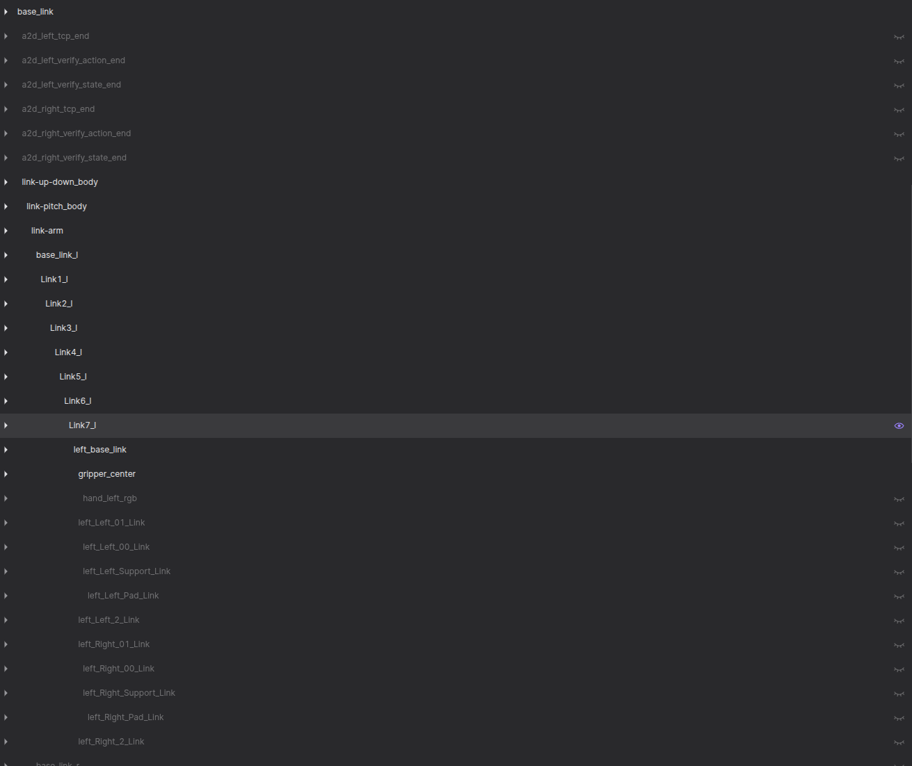

<div class="doc-series">数采平台 · 内部技术分享</div>

# 从 Joint 到 End Pose

<div class="cover-subtitle">坐标语义、URDF 结构模型与末端位姿解算</div>

<div class="cover-summary">
本文以 A2D 构型为主要示例，说明平台如何从关节数据和机器人结构模型生成可解释、可校验的末端位姿。
</div>

<div class="cover-meta">
受众：具备编程基础、尚未系统接触 ROS / URDF / TF 的平台开发人员<br>
建议讲解时长：30 分钟　·　正式载体：Slidev HTML　·　离线备用：PDF
</div>

<!--
本分享同时提供后续参与 FK 模块开发所需的最低技术基础。
A2D 用于解释 URDF、TF 和 FK；拥有 Raw End 的 DWHEEL 用于 Raw/Verify 对比。
-->

---

<div class="doc-section">01 · 业务背景</div>

# 末端位姿在数采平台中的业务作用

<div class="doc-columns equal">
<div>

## 业务问题

平台接入的机器人数据可能来自厂商 ROS 话题、MCAP、H5 和平台计算模块。不同来源可能使用不同 endpoint、reference frame、姿态格式和时间语义。如果这些信息未被明确约束，数值正确也不代表数据可被比较或用于训练。

## 平台需要解决的问题

- 统一表达动作目标与机器人实际状态。
- 为训练数据提供明确、稳定的操作语义。
- 将厂商坐标系和厂商 Raw End 归一化到平台约定。
- 使用 URDF 与 joint 数据计算可复现的 Verify/FK End。
- 通过 Foxglove、误差统计和质量报告验证交付数据。

</div>
<div>

## 本文完成后的能力目标

听众应能够：

1. 判断一条 Pose 是否具备完整语义。
2. 区分 Action/State、Raw/FK、Reference/TCP。
3. 解释 world、`base_link` 与 vendor frame 的适用范围。
4. 阅读 URDF 中 link、joint、origin、axis、mesh 的基本定义。
5. 描述 FK 沿运动链计算 End Pose 的过程。
6. 识别 mapping、单位、方向和 timestamp 等常见风险。
7. 使用 Foxglove 对 TF 和 End Pose 进行基本检查。

<div class="scope-note"><strong>范围边界：</strong>本文不展开 IK、Jacobian、动力学、运动规划、完整姿态转换推导、TCP 标定方法、ROS TF API、STL 内部格式、完整 H5 schema、GPU FK 或复杂数值优化。</div>

</div>
</div>

---

<div class="doc-section">02 · 平台主线</div>

# 从原始数据到统一 End Pose 的处理链路

<div class="business-flow">
  <div><span class="step">01</span><strong>数据接入</strong><br>ROS / MCAP / H5<br>Action/State Joint<br>厂商 Raw End</div>
  <span>→</span>
  <div><span class="step">02</span><strong>语义确认</strong><br>endpoint / frame<br>timestamp / unit<br>mapping / convention</div>
  <span>→</span>
  <div><span class="step">03</span><strong>模型与计算</strong><br>URDF / Config<br>坐标归一化 / FK<br>Reference → TCP</div>
  <span>→</span>
  <div><span class="step">04</span><strong>校验与交付</strong><br>Raw / Verify<br>H5 / 质量报告<br>Foxglove</div>
</div>

<div class="doc-columns equal" style="margin-top:24px">
<div>

## 两条主要输入路径

| 路径 | 处理方式 |
|---|---|
| 厂商 Raw End | 确认 endpoint 与 frame，转换到平台约定坐标系 |
| Action/State Joint | 通过同一 URDF/FK 模块分别计算 Verify Action/State End |

</div>
<div>

## 统一输出原则

- Reference End 可继续叠加固定 offset 得到 TCP End。
- H5、质量报告和 Foxglove 必须使用一致的 Pose 数据契约。
- `h5_tf_exporter`、`hpc_executor` 等生产模块只承担流程角色；本文不展开其完整配置 schema 和调用细节。

</div>
</div>

<div class="takeaway"><strong>阅读主线：</strong>后续每一节都用于解释这条处理链路中的一个输入、模型、计算或校验问题。</div>

---

<div class="doc-section">03 · 数据契约</div>

# 一条可使用的 Pose 必须包含哪些语义

<div class="definition"><strong>通用定义</strong>　Pose 表示位置与姿态的组合；在数据平台中，仅有 position 和 orientation 仍不足以唯一解释一条记录。</div>

| 字段或语义 | 需要回答的问题 | 平台校验要求 | 常见风险 |
|---|---|---|---|
| endpoint | 描述机器人上的哪个点？ | 比较前必须一致 | wrist、gripper center、TCP 被混用 |
| reference frame | 相对哪个坐标系表达？ | 必须明确 frame 名称与变换方向 | world、base_link、vendor frame 混用 |
| timestamp | 对应哪个时刻？ | 动态比较前必须对齐 | Action/State 出现时间错位 |
| position | 末端位于何处？ | 必须明确长度单位 | mm / m 导致 1000 倍误差 |
| orientation | 末端朝向如何？ | 必须明确表示和分量顺序 | RPY 顺序、xyzw/wxyz 不一致 |

```text
Platform Pose Contract
= Endpoint + Reference Frame + Timestamp
+ Position + Orientation + Unit / Convention
```

<div class="platform-rule"><strong>平台约定：</strong>只有 endpoint、frame、timestamp、单位与姿态 convention 一致的两条 Pose，才可以直接进行数值比较。</div>

---

<div class="doc-section">04 · 坐标语义</div>

# 坐标轴颜色约定与解释边界

<div class="doc-columns equal">
<div>

<div class="axis-contract">
  <span class="axis-x">X · 红色</span>
  <span class="axis-y">Y · 绿色</span>
  <span class="axis-z">Z · 蓝色</span>
</div>

## 通用说明

- 这是 Foxglove、RViz 等机器人可视化工具的常见颜色约定，不是数学定义的强制要求。
- 每个 link 或自定义 frame 均可拥有自己的 XYZ 坐标轴。
- 不同 frame 的轴方向可以完全不同，并随对应 link 一起运动。

</div>
<div>

## 解释要求

- 不得依据屏幕的上、下、左、右推断坐标轴方向。
- 不应将“红色轴”直接等同于 roll。仅在明确旋转约定后，才可以说明 roll、pitch、yaw 与绕 X、Y、Z 轴旋转的关系。
- 读取 TF 或 Pose 前，应先确认 parent frame、child frame 和变换方向。

<div class="example"><strong>构型示例：</strong>A2D 同时显示大量 link frame；侧视图和俯视图中的轴在屏幕上方向不同，但 frame 的物理定义没有变化。</div>

</div>
</div>

<div class="takeaway"><strong>判断规则：</strong>坐标值必须与其 frame 一起解释；屏幕视角不属于数据语义。</div>

---
class: evidence-slide
---

<div class="evidence-header">案例 1 · 单关节坐标轴</div>

<div class="evidence-caption">
红、绿、蓝分别表示 X、Y、Z 轴。该颜色是可视化约定；轴的物理方向由 frame 定义，而不是由屏幕方向决定。
</div>

<!--
备用素材：a2d-foxglove-top-frames.png 用于从俯视角度再次说明“屏幕方向不等于坐标轴方向”。
待补简化截图：仅显示 base_link、Link6_l、Reference End 和 TCP。
-->

---

<div class="doc-section">05 · 坐标系选择</div>

# world、base_link 与厂商自定义坐标系

| 坐标系 | 定义 | 优势 | 局限 | 适用场景 |
|---|---|---|---|---|
| `world` | 固定于场地或场景的全局参考系 | 表达全局轨迹和多机器人关系 | 依赖定位、标定或场地定义 | 移动轨迹、跨设备关系 |
| `base_link` | 固定于机器人本体并随整机移动 | 与 URDF/FK 衔接，机器人内部语义稳定 | 不能直接表示场地中的全局位置 | 机械臂 FK、统一 End、内部校验 |
| vendor frame | 厂商控制器或传感器定义的参考系 | 与原始 topic 和厂商系统直接对应 | 构型间可能不一致，定义可能不明确 | 原始接入、厂商问题追踪 |

<div class="platform-rule"><strong>平台当前状态：</strong><code>base_link</code> 是 URDF 运动学根节点，不天然等于外部世界坐标系。<code>end_config.yaml</code> 通过 <code>urdf.world_frame</code> 与 <code>urdf.world_to_base</code> 表达外部参考系到 <code>base_link</code> 的静态变换；当前构型均使用单位变换占位，因此数据语义上暂为 <code>world = base_link</code>。</div>

<div class="doc-columns equal" style="margin-top:20px">
<div>

## 坐标归一化

厂商提供 $T_{vendor\rightarrow end}$，并已知 $T_{base\rightarrow vendor}$：

$$T_{base\rightarrow end}=T_{base\rightarrow vendor}T_{vendor\rightarrow end}$$

</div>
<div>

## 校验要求

- `base_link` 是模型选定的本体参考 frame，不保证位于几何中心。
- vendor frame 本身不是错误；风险来自未声明或与 `base_link` Pose 直接混用。
- 坐标归一化不改变物理位置，只改变表达方式。
- 计算前必须确认厂商 Pose 的方向是 `vendor→end`，而不是 `end→vendor`。

</div>
</div>

<div class="placeholder">动画占位：同一末端分别在 world / base_link / vendor frame 下显示，8–12 秒。</div>

---
class: evidence-slide
---

<div class="evidence-header">案例 2 · 外部 world_frame 的建立方式</div>

<div class="evidence-caption">
候选方案包括：利用下肢静止假设重定位 <code>base_link</code>、通过头部或第三方相机识别标记、通过外部红外基站跟踪标记。三者分别侧重低硬件成本、已有视觉设备复用和外部测量精度；均必须显式记录标定、可见性与适用边界。
</div>

---

<div class="doc-section">06 · 姿态表示</div>

# RPY、Rotation Matrix 与 Quaternion

| 表示方式 | 数据形式 | 主要优势 | 约束与风险 | 平台中的常见用途 |
|---|---|---|---|---|
| RPY / Euler Angles | `[roll, pitch, yaw]` | 三个数，人工阅读和配置较直观 | 依赖旋转顺序；存在 gimbal lock | URDF `origin rpy`、配置、调试显示 |
| Rotation Matrix | 3×3 matrix | 可直接参与坐标变换与矩阵组合 | 九个数、有冗余；应保持正交 | FK 与坐标变换内部计算 |
| Quaternion | `[x, y, z, w]` | 四个数、无 gimbal lock，适合组合和插值 | 不直观；必须确认 `xyzw/wxyz` | ROS、H5、程序输出 |

<div class="doc-columns equal" style="margin-top:18px">
<div>

## 通用定义

三种表示描述的是同一个物理姿态，而不是三种不同姿态。quaternion 通常应保持单位长度；`q` 与 `-q` 表示同一旋转。

</div>
<div>

## 实现约定

URDF 使用 RPY 便于人工配置；FK 通常将 RPY 或 quaternion 转换为 rotation matrix 参与计算，再按输出协议转换回 quaternion。正文不展开完整转换公式。

</div>
</div>

<div class="platform-rule"><strong>校验要求：</strong>比较 orientation 前，必须明确 RPY 顺序、角度单位以及 quaternion 分量顺序。</div>

---

<div class="doc-section">07 · 末端语义</div>

# 末端位姿的三个分类维度

<div class="doc-columns equal">
<div>

| 分类维度 | 取值 | 回答的问题 |
|---|---|---|
| 目标与实际 | Action / State | 数据是控制目标还是传感器实际状态？ |
| 数据来源 | Raw / Verify(FK) | 位姿由厂商直接提供，还是平台计算？ |
| endpoint 语义 | Reference / TCP / custom | 描述机器人上的哪个物理或语义点？ |

三个维度彼此独立。例如，平台可以生成 `Verify State TCP End`，也可以接收厂商提供的 `Raw State End`。

</div>
<div>

## 常见 endpoint

- wrist reference frame
- gripper center
- Tool Center Point（TCP）
- camera optical frame
- foot contact point 或其他自定义操作点

End 通常对应 link frame 或 custom frame，而不是 joint。URDF 最后一个可见 mesh 也不必然是业务需要的 endpoint。

</div>
</div>

## Reference End 与 TCP

$$T_{base\rightarrow tcp}=T_{base\rightarrow reference}T_{reference\rightarrow tcp}$$

`T_{base→reference}` 可由 State FK 计算；`T_{reference→tcp}` 可来自 URDF fixed joint 或人工标定。本文不展开 TCP 标定方法。

---

<div class="doc-section">08 · 数据来源与状态</div>

# Action/State 与 Raw/Verify 的定义和比较前提

<div class="doc-columns equal">
<div>

## Action End / State End

| 类型 | 精确定义 |
|---|---|
| Action | 发给机器人的关节控制指令 |
| State | 传感器或控制器返回的实际关节状态 |
| Action End | Action joint 经模型和 FK 得到的目标末端位姿 |
| State End | State joint 经模型和 FK 得到的实际末端位姿 |

两者使用相同的机器人模型和 FK。正常差异可来自控制延迟、速度限制、负载、跟踪误差、传感器噪声或 timestamp 未对齐。

</div>
<div>

## Raw End / Verify End

| 类型 | 精确定义 |
|---|---|
| Raw End | 厂商 ROS topic 或控制器直接提供的 End Pose |
| Verify/FK End | 平台使用 joint 数据和 URDF 计算的诊断 End Pose |

Raw 接入成本低，但 frame、endpoint 和质量可能不统一；Verify 过程可控，但依赖正确的 URDF、mapping、单位和时间。Raw 不必然错误，Verify 也不自动正确。

</div>
</div>

<div class="example"><strong>构型使用边界：</strong>A2D 没有 Raw End，用于解释 URDF 和 FK；DWHEEL 具有 Raw End，用于 Raw/Verify 对比。不得将两个构型的示例语义混为一谈。</div>


<div class="image-note">图示结论：运动过程中 Action End 与 State End 通常存在一定错位；比较前仍须先对齐 timestamp、frame 与 endpoint。</div>

---

<div class="doc-section">09 · 结构模型</div>

# URDF 的职责与边界

<div class="definition"><strong>通用定义</strong>　URDF（Unified Robot Description Format）使用 XML 描述机器人结构模型。</div>

<div class="doc-columns equal">
<div>

## URDF 描述的内容

- 机器人由哪些 `link` 组成。
- link 之间通过哪些 `joint` 连接。
- joint 的 parent/child、安装位置、姿态、运动轴、类型和限制。
- link 的 visual、collision、inertial 信息。
- mesh 文件的位置及其相对 link frame 的放置方式。

</div>
<div>

## URDF 不承担的职责

- 不保存每一帧实时 joint state。
- 不是机器人控制程序。
- 不是完整 CAD 工程。
- 不直接给出指定时刻的 End Pose。

URDF 提供静态结构；运行时 joint 数据提供当前 q；FK 将二者组合为 TF 和 End Pose。

</div>
</div>

<div class="example"><strong>A2D 示例：</strong><code>assets/source/A2D.urdf</code> 是完整树状模型。正文仅截取左臂和 Link6_l 附近结构，不展示 2400 多行完整 XML。</div>

---

<div class="doc-section">10 · Link / Joint / Tree</div>

# 从 URDF Tree 中提取一条 Kinematic Chain

<div class="chain-doc">
  <span>Link5_l</span><b>→</b><span>left_arm_joint6</span><b>→</b><span>Link6_l</span><b>→</b><span>left_arm_joint7</span><b>→</b><span>Link7_l</span><b>→</b><span>left_base_link</span><b>→</b><span>gripper_center</span>
</div>

| 概念 | 定义 | 实现意义 |
|---|---|---|
| link | 刚体部件及固定在该部件上的 frame | FK 的节点；End 通常对应 link/custom frame |
| joint | parent link 与 child link 的连接及允许运动 | 提供固定 origin、axis、type 等结构信息 |
| kinematic chain | 从 base 到指定 end 的有序路径 | FK 仅遍历该路径，不需要遍历完整树 |
| URDF tree | 完整机器人的 link/joint 拓扑 | 非根 link 通常只有一个 parent joint，可有多个 child joint |

<div class="doc-columns equal" style="margin-top:16px">
<div>

- 三自由度腕部通常通过三个单自由度 joint 串联表达。
- joint 之间需要 link；中间 link 可以没有实体长度或 mesh。

</div>
<div>

<div class="placeholder">待补图：A2D 完整模型逐步淡化其他分支并高亮左臂；Link5_l 到 gripper_center 的简化 URDF Tree。</div>

</div>
</div>

---

<div class="doc-section">11 · Joint 定义</div>

# left_arm_joint6：字段定义与运行时含义

<div class="doc-columns equal">
<div>

```xml
<joint name="left_arm_joint6" type="revolute">
  <origin xyz="0 0 0"
          rpy="-1.5708 0 3.1416"/>
  <parent link="Link5_l"/>
  <child link="Link6_l"/>
  <axis xyz="0 0 -1"/>
  <limit lower="-2.356" upper="2.356"
         effort="30" velocity="3.14"/>
</joint>
```

</div>
<div>

| 字段 | 严格含义 |
|---|---|
| parent / child | joint 连接的前后两个 link |
| origin xyz/rpy | joint frame 相对 parent link 的固定安装位姿 |
| axis | revolute 旋转轴或 prismatic 平移轴；在 joint frame 中表达 |
| type | fixed / revolute / continuous / prismatic |
| limit | 位置、速度、力矩等限制 |

`origin rpy` 不是当前 joint angle。`axis="0 0 -1"` 表示运行时绕 joint frame 的负 Z 轴旋转；当前 q 来自 Action/State joint position。

</div>
</div>

<div class="platform-rule"><strong>解释边界：</strong>URDF 允许任意合法 axis 向量。A2D 中使用主轴方向是构型现状，不应表述为 URDF 的通用限制。</div>

<div class="placeholder">动画占位：先显示 origin，再显示负 Z axis，最后播放 Link6_l 随 q 旋转，6–10 秒。</div>

---
class: evidence-slide tf-message-slide
---

<div class="evidence-header">案例 2 · Link5_l → Link6_l 的运行时 TF Transform</div>

<div class="evidence-caption">
该消息展示 parent frame、child frame、timestamp、translation 和 quaternion；Foxglove 同时显示换算后的 RPY。它是运行时变换结果，不是 URDF joint 原始定义。
</div>

---

<div class="doc-section">12 · Mesh 与语义 Frame</div>

# Mesh、STL、Visual/Collision 与 Meshless Link

<div class="doc-columns equal">
<div>

```xml
<link name="Link6_l">
  <visual><geometry>
    <mesh filename="./meshes/Link6_l.STL"/>
  </geometry></visual>
  <collision><geometry>
    <mesh filename="./meshes/Link6_l.STL"/>
  </geometry></collision>
</link>
```

URDF 描述结构、连接和坐标关系；STL 只描述零件的三角形表面，不包含 parent、child、joint 或运动规则。

</div>
<div>

| 元素 | 作用与边界 |
|---|---|
| visual | 用于显示；visual origin 是 mesh 相对 link frame 的位姿，不是 joint origin |
| collision | 用于碰撞检测；可以采用更简单 mesh 降低计算量 |
| inertial | 用于动力学属性；本文不展开 inertia 计算 |

A2D 的 Link6_l visual 与 collision 引用同一 STL。

```xml
<link name="gripper_center"/>
```

没有 mesh 的 link 仍然是合法 frame，可用于 Reference End、TCP、传感器 frame 或虚拟中间结构。

</div>
</div>

<div class="placeholder">待补：Link6_l frame 与 STL 的关系图；隐藏 mesh 后显示 gripper_center frame。</div>

---

<div class="doc-section">13 · 信息分层</div>

# 结构定义、运行时关节状态与 TF 变换

<div class="layer-grid">
<div>
  <div class="layer-title">URDF Joint · 静态结构</div>
  parent / child<br>origin position + orientation<br>axis / type / limit
</div>
<div class="layer-arrow">+</div>
<div>
  <div class="layer-title">Runtime Joint · 动态状态</div>
  position q<br>可选 velocity / effort<br>Action 或 State 语义
</div>
<div class="layer-arrow">→</div>
<div>
  <div class="layer-title">TF Transform · 计算结果</div>
  parent frame → child frame<br>translation + rotation<br>timestamp
</div>
</div>

<div class="doc-columns equal" style="margin-top:24px">
<div>

## 规范表述

不能笼统地说“一个 joint 保存 position、orientation 和 axis”。更准确的表述是：

1. URDF joint 保存固定安装位姿、axis、type 等结构信息。
2. 运行时 joint 数据提供当前 q；常见一自由度 joint 的 position 通常是标量。
3. FK 根据结构信息和 q 计算 parent→child 的 TF transform。

</div>
<div>

## 与 End Pose 的关系

```text
URDF Joint + Action/State Joint Position
→ FK
→ TF Transform
→ Reference End Pose
→ Optional TCP Offset
→ TCP End Pose
```

截图中的 TFMessage 属于第三层，而不是第一层。

</div>
</div>

---

<div class="doc-section">14 · 变换约定</div>

# 齐次变换与单 Joint 变换的计算规则

<div class="doc-columns equal">
<div>

## 齐次变换

$$T=\begin{bmatrix}R&p\\0&1\end{bmatrix}$$

- `R`：3×3 rotation matrix，表示姿态。
- `p`：3×1 position，表示位置。
- `T`：同时表达旋转和平移，便于连续组合相邻 frame。

正文不推导齐次坐标理论；只需理解 FK 为什么使用 4×4 matrix multiplication。

</div>
<div>

## 单 Joint 变换

$$T_{parent\rightarrow child}(q)=T_{origin}T_{motion}(q)$$

| Joint type | 变换 |
|---|---|
| fixed | $T=T_{origin}$ |
| revolute / continuous | $T=T_{origin}R(axis,q)$ |
| prismatic | $T=T_{origin}Trans(axis\cdot q)$ |

revolute/continuous 的 q 通常为 rad；prismatic 通常为 m。

</div>
</div>

<div class="platform-rule"><strong>计算约束：</strong><code>origin</code> 在前、<code>motion(q)</code> 在后，矩阵乘法顺序不可交换。fixed joint 虽无 q，但可能包含关键 origin，不得直接从 chain 删除。</div>

<div class="placeholder">待补：齐次矩阵示意；动画“先应用 origin，再应用 joint motion”，8–12 秒。</div>

---

<div class="doc-section">15 · FK 算法</div>

# 沿 base → end 的运动链累积变换

<div class="doc-columns code-wide">
<div>

```text
base_link
→ shoulder
→ elbow
→ wrist
→ reference end
```

$$T_{base\rightarrow end}=T_1T_2\cdots T_n$$

## 计算步骤

1. 从单位矩阵开始。
2. 按 base→end 的有序 chain 遍历 joint。
3. 对每个 joint 依次应用 origin 和 motion(q)。
4. 每步执行 `base_to_child = base_to_parent @ parent_to_child`。
5. 最终 position 取自 `T[:3,3]`，rotation matrix 转为输出 quaternion。

</div>
<div>

```python
def forward_kinematics(chain, joint_values):
    T = identity_transform()

    for joint in chain:
        T = T @ origin_transform(
            joint.origin_xyz, joint.origin_rpy)

        if joint.type in {"revolute", "continuous"}:
            T = T @ rotation_transform(
                joint.axis, joint_values[joint.name])
        elif joint.type == "prismatic":
            T = T @ translation_transform(
                joint.axis * joint_values[joint.name])

    position = T[:3, 3]
    orientation = matrix_to_quaternion(T[:3, :3])
    return position, orientation
```

</div>
</div>

<div class="platform-rule"><strong>方向约束：</strong>矩阵乘法具有方向和顺序。如果实现得到的是 <code>end→base</code>，需要求逆后才能得到平台约定的 <code>base→end</code>。</div>

<!-- 正文不展开 rotation_transform、Rodrigues 公式和 matrix_to_quaternion 的内部推导。 -->

---

<div class="doc-section">16 · 工程实现</div>

# FK 的输入、批量 H5 与配置职责

<div class="three-business">
<div>

## 静态输入 · 初始化阶段

- 有序 kinematic chain
- parent / child / origin / axis / type
- base link / Reference End
- H5 channel → URDF joint mapping
- TCP offset 与可预计算 origin transform

</div>
<div>

## 动态输入与输出

每帧输入：Action 或 State joint position + timestamp。

```text
position:    [x, y, z]
orientation: [x, y, z, w]
```

```python
action_end = fk(chain, action_q)
state_end  = fk(chain, state_q)
tcp_end    = compose(state_end, tcp_offset)
```

</div>
<div>

## 批量 H5

```text
N frames × J joints
→ N frames × End Pose
```

- 不得每帧重复解析 URDF。
- 应缓存 chain 和 origin transform。
- 可批量构造 rotation/translation matrix。
- 可用 NumPy 向量化并复用多 End 的共享中间 transform。
- 应减少小对象重复分配。

</div>
</div>

<div class="doc-columns equal" style="margin-top:18px">
<div>

| 配置 | 职责 |
|---|---|
| `robot.yaml` | URDF、base_link、joint limit、H5 channel→URDF joint mapping |
| `end_config.yaml` | Raw/Verify/TCP 计算、raw frame、Reference End、TCP offset |

</div>
<div>

单帧复杂度约为 O(J)。实现顺序应为：先保证数据语义、mapping 和单帧结果正确，再进行批量与性能优化。

</div>
</div>

---

<div class="doc-section">17 · URDF / TF</div>

# URDF Tree 与 TF Tree 的职责边界

| 对比项 | URDF Tree | TF Tree |
|---|---|---|
| 核心职责 | 描述机器人模型中的 link/joint 拓扑 | 描述运行时所有 frame 的连接关系 |
| 主要来源 | URDF XML | URDF、FK、传感器和程序发布的 transform |
| 时间属性 | 不包含每帧实时姿态 | transform 随时间更新 |
| 覆盖范围 | 通常是机器人本体 | 还可包含 world、camera、TCP、verify end 等 frame |

<div class="doc-columns equal" style="margin-top:20px">
<div>

## A2D 示例

A2D 的 TF Tree 包含 `world`、`base_link`、各级 link、TCP、verify action end 和 verify state end。额外 End frame 不一定存在于原始 URDF，可以由程序计算后发布。

</div>
<div>

## 结构约束

TF Tree 必须保持树状父子关系。循环或多父节点会导致变换无法被正确解析。检查某个 End 时，应从目标 frame 反向追踪到约定 base frame，并确认链路连续。

</div>
</div>

---
class: evidence-slide tree-overview-slide
---

<div class="evidence-header">案例 3 · A2D 完整 TF Tree</div>

<div class="evidence-caption">
本页用于展示运行时 frame 的整体规模，不要求阅读全部节点。实际检查应选择一条目标 chain 进行局部追踪。
</div>

---
class: evidence-slide tree-detail-slide
---

<div class="evidence-header">案例 4 · Foxglove 中的左臂 Frame 层级</div>

<div class="evidence-caption">
从 <code>base_link</code> 进入左臂分支，依次检查各级 link，最终定位 Reference End、gripper center、TCP 和 verify end。该方法用于验证 parent/child、joint mapping 与 End 发布关系。
</div>

---

<div class="doc-section">18 · 校验与问题定位</div>

# FK 与 End Pose 的验证顺序

<div class="doc-columns equal">
<div>

## 开发阶段

1. **Zero Pose**：可动 joint 全设为 0，与 URDF 查看器结果比较。
2. **Single Joint**：一次仅改变一个 joint，检查 child chain 和 axis 方向。
3. **Fixed Joint**：确认固定 position/rotation 未丢失。
4. **Reference Implementation**：与 Foxglove、已验证 FK 库或参考程序比较。

## 数据阶段

1. 对齐 timestamp、endpoint、reference frame、单位和 convention。
2. 叠加 Raw End 与 Verify End。
3. 比较 position 和 orientation 差异。
4. 检查轨迹连续性、固定偏差和异常跳变。

</div>
<div>

| 问题 | 典型表现 |
|---|---|
| 矩阵顺序 / base-end 方向错误 | 整体位置与姿态异常 |
| 忽略 origin rotation / axis frame 错 | child link 沿错误方向运动 |
| 遗漏 fixed joint | 固定位置或姿态偏差 |
| joint mapping / 正负方向错误 | link 跟随错误 joint 或反向运动 |
| degree/radian、mm/m | 幅度异常或 1000 倍误差 |
| xyzw/wxyz | orientation 异常 |
| Action/State 时间未对齐 | 两条轨迹动态错位 |
| endpoint 不同 | Raw/Verify 持续固定偏差 |

</div>
</div>

<div class="doc-columns equal" style="margin-top:14px">
<div>位置误差：$e_p=\lVert p_{raw}-p_{verify}\rVert$</div>
<div>姿态误差：$e_q=2\arccos(|q_{raw}\cdot q_{verify}|)$</div>
</div>

<div class="platform-rule"><strong>解释原则：</strong>固定偏差通常指向 frame、endpoint、offset 或 URDF 定义差异；抖动或跳变可能来自时间、数据、传感器、mapping 或通信。Raw/Verify 不一致不等于 FK 必然错误。</div>

---

<div class="doc-section">19 · 演示与结论</div>

# Foxglove 演示 Runbook 与核心结论

<div class="doc-columns equal">
<div>

## 建议演示顺序 · 2 分钟

1. 显示 A2D 整体模型和 RGB frame。
2. 在 TF Tree 中从 `base_link` 追踪左臂末端。
3. 显示 Action End 与 State End。
4. 显示 Reference End 与 TCP。
5. 时间允许时展示 DWHEEL Raw End 与 Verify End。

## 演示准备

- 优先使用预录 MP4/WebM 或已定位的 MCAP 时间段。
- 提前加载 Foxglove layout 和数据，不在现场检索 topic。
- 所有动态演示必须准备静态截图或 PDF 备用。
- 完整 MCAP 不应默认提交到公开仓库。

</div>
<div>

## 四项结论

1. Pose 只有在 endpoint、frame、timestamp、单位和 convention 明确时才具备完整语义。
2. Action/State、Raw/FK、Reference/TCP 是三个独立分类维度。
3. URDF 定义静态结构，运行时 joint 提供 q，FK 计算 TF 和 End Pose。
4. FK 的工程可信度主要取决于 mapping、单位、坐标方向、endpoint 和时间对齐。

<div class="takeaway"><strong>最终判断规则：</strong>先确认“数据描述的对象和参考关系”，再判断数值是否正确。</div>

</div>
</div>

---
class: appendix-business material-register
---

<div class="doc-section">附录 · 素材与维护</div>

# 素材登记、后续数据与 Slidev 约束

<div class="three-business micro-register">
<div>

## 已有素材

- `A2D.urdf`：完整结构模型
- `a2d-foxglove-side-frames.png`
- `a2d-foxglove-top-frames.png`
- `a2d-tf-tree-full.png`
- `a2d-tf-tree-left-chain.png`
- `a2d-tf-message-body.png`
- `a2d-tf-message-arm.png`

图片 217 的像素均透明，未作为有效展示素材。

</div>
<div>

## 待补图片

`endpoints-reference-tcp.png`、`pose-semantics.svg`、`a2d-frames-clean.png`、`orientation-representations.svg`、`a2d-left-chain.svg`、`link6-mesh-frame.png`、`gripper-center-frame.png`、`homogeneous-transform.svg`、`batch-fk-pipeline.svg`、`error-patterns.svg`

## 待补动画

frame comparison、Action/State End、DWHEEL Raw/Verify、A2D chain highlight、joint6 motion、origin then motion、FK chain；建议单段 6–15 秒。

</div>
<div>

## 后续数据与维护约束

- 脱敏短 MCAP 或 Foxglove MP4/WebM
- DWHEEL Raw/Verify 对比时间段
- 正常但差异明显的 Action/State 时间段
- Link6_l 单 joint 运动数据
- 单一 `slides.md` + 全局 CSS
- 本地图片/视频，无在线字体、CDN、远程媒体
- 不引入第三方主题、插件或自定义 Vue
- XYZ 红绿蓝；Action/Raw 黄橙；State/Verify 青；TCP 紫
- HTML 正式演示；PDF 离线备用

规范性用语：<strong>必须</strong>表示缺少条件会导致数据不可正确解释；<strong>应</strong>表示平台推荐做法；<strong>可以</strong>表示可选实现；<strong>当前构型中</strong>用于区分构型事实与通用标准。

</div>
</div>
