<div class="doc-series">URDF · END · FK</div>

# URDF、End 与 FK

<div class="cover-summary">
从 A2D 的机器人结构文件、H5 中的关节数据和 End 结果出发，说明如何计算、理解和检查末端位姿。
</div>

---
class: module-divider
---

<div class="module-kicker">MODULE 01</div>

# URDF

<div class="module-summary">
URDF 回答“机器人结构是什么”：有哪些 link，joint 如何连接，每个 joint 的固定安装位置、旋转轴和运动类型是什么。
</div>

---
class: compact-business a2d-full-structure-slide
---

<div class="doc-section">00 · A2D 完整结构</div>

# A2D：从底盘 base_link 到 effector 的完整链路

<div class="doc-columns equal">
<div>

## 先看整体，再看代码

URDF 的主体结构可以理解为不断重复的：

```text
link → joint → link → joint → link
```

在 A2D 中，链路从底盘的 `base_link` 出发，经过身体、机械臂安装点、左臂各级 link，最终到达手部 effector 和 `gripper_center` 这样的末端语义 frame。

<div class="takeaway"><strong>讲解顺序：</strong>先用全身图建立直觉，再回到 URDF 代码里看每个 joint 如何把 parent link 接到 child link。</div>

</div>
<div>

<div class="a2d-full-grid">
  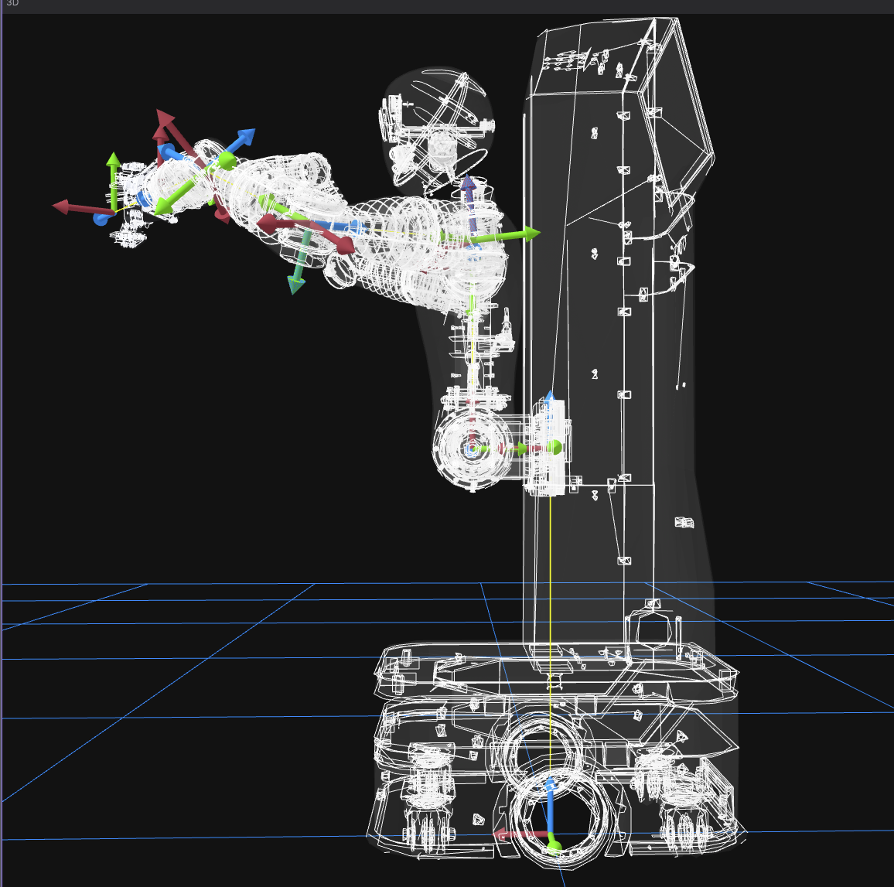
  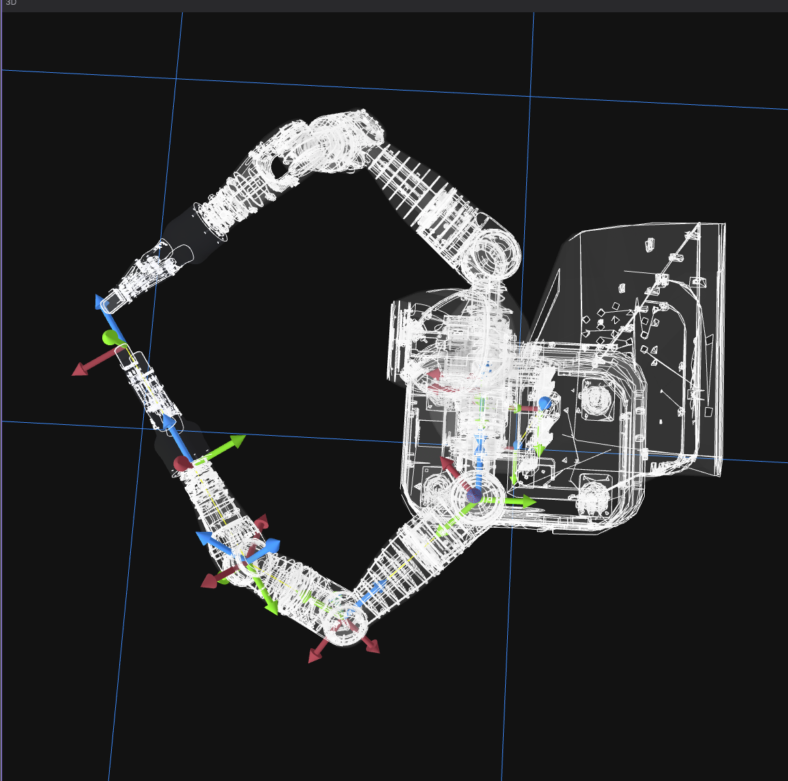
</div>
<div class="image-note">左：侧视图。右：俯视图。两张图都展示了从底盘到末端的 link-joint-link 连接关系。</div>

</div>
</div>

---
class: lecture-slide urdf-code-slide
---

<div class="doc-section">01 · URDF 基本结构</div>

# URDF：用 Link 和 Joint 描述机器人

<div class="doc-columns code-wide">
<div>

```xml
<!-- A2D.urdf -->
<!-- 固定安装：躯干上的机械臂基座 -->
<joint name="joint_left_arm_mount" type="fixed">
  <origin xyz="0 0.025 0" rpy="-1.5708 0 0"/>
  <parent link="link-arm"/>
  <child link="base_link_l"/>
</joint>

<!-- 可动关节：左臂第 6 轴 -->
<joint name="left_arm_joint6" type="revolute">
  <origin xyz="0 0 0" rpy="-1.5708 0 3.1416"/>
  <parent link="Link5_l"/>
  <child link="Link6_l"/>
  <axis xyz="0 0 -1"/>
</joint>
```

</div>
<div>

## 读代码时先抓四件事

| 字段 | 含义 |
|---|---|
| `parent / child` | 这条边从哪个 link 指向哪个 link |
| `origin xyz/rpy` | 零位姿下 child joint frame 相对 parent link 的固定变换 |
| `type` | joint 是 fixed、revolute、continuous 还是 prismatic |
| `axis` | revolute 的旋转轴或 prismatic 的平移轴 |

`fixed` joint 没有运行时关节值，但它的 `origin` 仍然是结构的一部分；`revolute` joint 的当前角度来自 H5 / rosbag 中的 joint position。

</div>
</div>

---
class: lecture-slide urdf-origin-slide
---

<div class="doc-section">02 · Origin 与运行时 q</div>

# `origin` 是安装位置，不是当前关节角

<div class="doc-columns equal">
<div>

```xml
<joint name="left_arm_joint6" type="revolute">
  <origin xyz="0 0 0"
          rpy="-1.5708 0 3.1416"/>
  <parent link="Link5_l"/>
  <child link="Link6_l"/>
  <axis xyz="0 0 -1"/>
</joint>
```

```python
# 固定安装变换 + 当前关节旋转
T_Link5_Link6 = T_origin @ rotation_transform(
    axis=[0, 0, -1],
    theta=q6,
)
```

</div>
<div>

## 两层信息要分开

| 来源 | 内容 | 是否随时间变化 |
|---|---|---|
| URDF `origin` | 固定安装位置和固定姿态 | 否 |
| URDF `axis/type` | 允许运动的方式 | 否 |
| H5 / rosbag joint position | 当前关节变量 `q6` | 是 |
| FK 输出 | 当前 parent→child transform | 是 |

`axis="0 0 -1"` 表示运行时绕 joint zero frame 的负 Z 轴旋转。真正转了多少，是每一帧的 `q6` 决定的。

</div>
</div>

---
class: lecture-slide urdf-chain-slide
---

<div class="doc-section">03 · Chain 与语义 Frame</div>

# 从 URDF Tree 里取出一条 End Chain

<div class="doc-columns code-wide">
<div>

```xml
<joint name="Joint_hand_l" type="fixed">
  <origin xyz="0 0 0" rpy="0 0 0"/>
  <parent link="Link7_l"/>
  <child link="left_base_link"/>
</joint>

<!-- 语义末端：夹爪中心 -->
<link name="gripper_center"/>
<joint name="gripper_center_joint" type="fixed">
  <origin rpy="0 0 -1.57079632679"
          xyz="0.0 0.0 0.23"/>
  <parent link="left_base_link"/>
  <child link="gripper_center"/>
</joint>
```

</div>
<div>

## End 往往是语义 frame

```text
base_link
→ ...
→ Link7_l
→ left_base_link
→ gripper_center
```

`gripper_center` 没有 mesh 也没关系。它是一个为了表达业务需要而存在的 frame：告诉我们“夹爪中心”相对手部 base link 的固定位置和方向。

<div class="takeaway"><strong>关键点：</strong>URDF 不只是可视化模型。对 FK 来说，它更像一张可遍历的结构图，每条边给出一段固定变换或可动变换。</div>

</div>
</div>

---
class: lecture-slide urdf-tf-half-slide
---

<div class="doc-section">04 · URDF 与 TF</div>

# URDF 是静态定义，TF 是运行时结果

<div class="doc-columns equal">
<div>

## 两者职责不同

| 对比项 | URDF | TF |
|---|---|---|
| 内容 | link/joint 结构 | frame 间实时 transform |
| 时间 | 静态文件 | 带 timestamp |
| 输入 | XML 中的 origin、axis、type | URDF + 当前 joint values |
| 用途 | 提供结构约束 | 展示某一时刻的空间关系 |

`left_arm_joint6` 在 URDF 中只说明结构；TF message 中出现的 translation 和 rotation 是某个时间点计算后的结果。

</div>
<div>

<div class="tf-pair">
  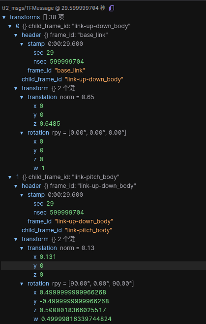
  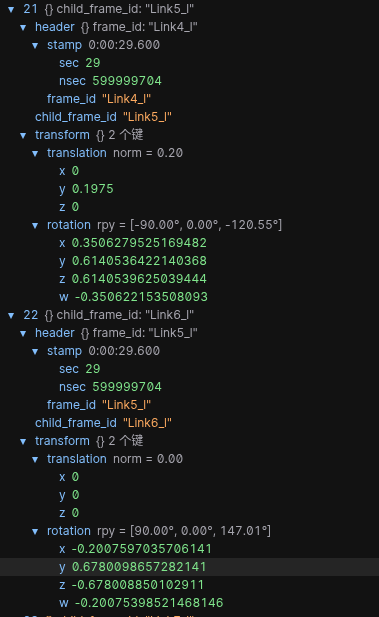
</div>
<div class="image-note">TF message 适合用来确认 parent/child、timestamp、translation 和 quaternion 是否符合预期。</div>

</div>
</div>

---
class: module-divider
---

<div class="module-kicker">MODULE 02</div>

# End

<div class="module-summary">
End 回答“描述哪个末端点、相对哪个坐标系、在什么时刻、用什么格式表达”。
</div>

---
class: compact-business end-contract-slide
---

<div class="doc-section">01 · End 数据契约</div>

# 一条可使用的 End Pose 必须说明什么

<div class="doc-columns equal">
<div>

| 字段 | 含义 |
|---|---|
| `reference_link` | 这个 End 对应的 URDF 结构中的 link，例如 `gripper_center` |
| `reference_frame` | 这个点相对谁表达，例如 `base_link`、world 或 vendor frame |
| `timestamp` | 对应哪个采样、指令或计算时刻 |
| `position` | 末端点在参考坐标系中的位置，通常是 `[x, y, z]` |
| `orientation` | 末端坐标系相对参考坐标系的朝向，H5/ROS 常用 quaternion |

## orientation 的三种表达

| 表达 | 使用场景 | 例子 |
|---|---|---|
| Quaternion | H5 内部保存 | `[0, 0, 0.7071, 0.7071]` |
| Rotation Matrix | FK 计算 | `T[:3, :3]` |
| RPY | 人类阅读 / URDF | `[0, 0, 1.5708]` |

三种表达描述同一个朝向，可以互相转换；比较 End 前要确认 orientation 约定一致。

</div>
<div>

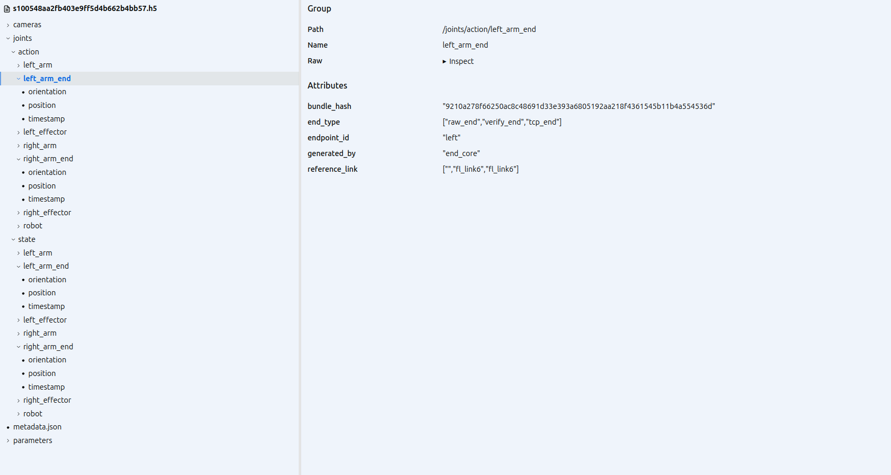
<div class="image-note">normalize 后的 H5 中，Action/State 下会出现多个 End 候选组；字段名和 group 层级本身就是数据契约的一部分。</div>

</div>
</div>

<!--
- 简单说一下目前end在h5中保存的结构
- end pose主要由position也就是xyz, 还有orientation构成
- 其中orientation有三种表达方法
- 另外除了坐标和姿态, 一个end pose还需要包含reference_link和reference_frame(目前我们预期的归一化后的坐标系应该都是baselink, 所以这里不用标)
-->

---
class: compact-business axis-color-slide
---

<div class="doc-section">02 · 坐标轴颜色</div>

# XYZ 坐标轴颜色约定

<div class="doc-columns equal">
<div>

<div class="axis-contract">
  <span class="axis-x">X · 红色</span>
  <span class="axis-y">Y · 绿色</span>
  <span class="axis-z">Z · 蓝色</span>
</div>

| 颜色 | 坐标轴 | 说明 |
|---|---|---|
| 红色 | X | frame 自己的 X 方向 |
| 绿色 | Y | frame 自己的 Y 方向 |
| 蓝色 | Z | frame 自己的 Z 方向 |

颜色只是 Foxglove / RViz 等工具的常见显示约定。真正重要的是：每个 link 或末端 frame 都有自己的 XYZ 轴，方向会随着对应 link 一起运动。

</div>
<div>

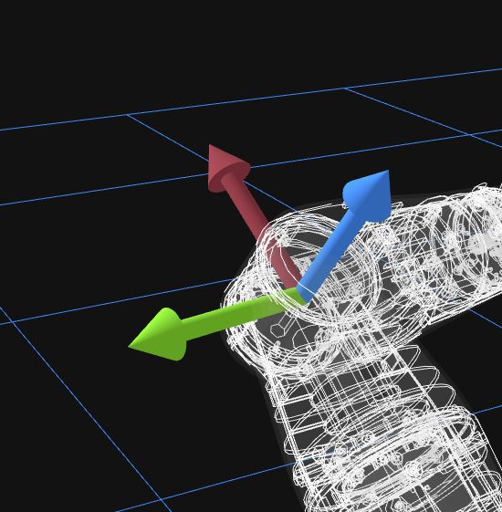
<div class="image-note">红、绿、蓝分别表示 X、Y、Z。屏幕方向不等于坐标轴方向，要以 frame 定义为准。</div>

</div>
</div>

<!--
简单说一下三种颜色
-->

---
class: compact-business world-frame-slide
---

<div class="doc-section">03 · world 与 base_link</div>

# 只区分两类：base_link 坐标系与 world 坐标系

<div class="doc-columns equal">
<div>

| 坐标系 | 含义 |
|---|---|
| `base_link` | 固定在机器人本体上的运动学根 frame。手臂 FK 通常先计算末端相对 `base_link` 的位姿。 |
| `world` | 外部参考系。它可以由地面、脚底/底盘接地点、基站、第三方相机或标定板定义。 |

URDF 只告诉我们 `base_link` 和各 link/joint 的关系；它不会自动给出外部世界。要使用 `world`，必须额外说明 `world → base_link` 的来源。

</div>
<div>

<div class="world-image-grid">
  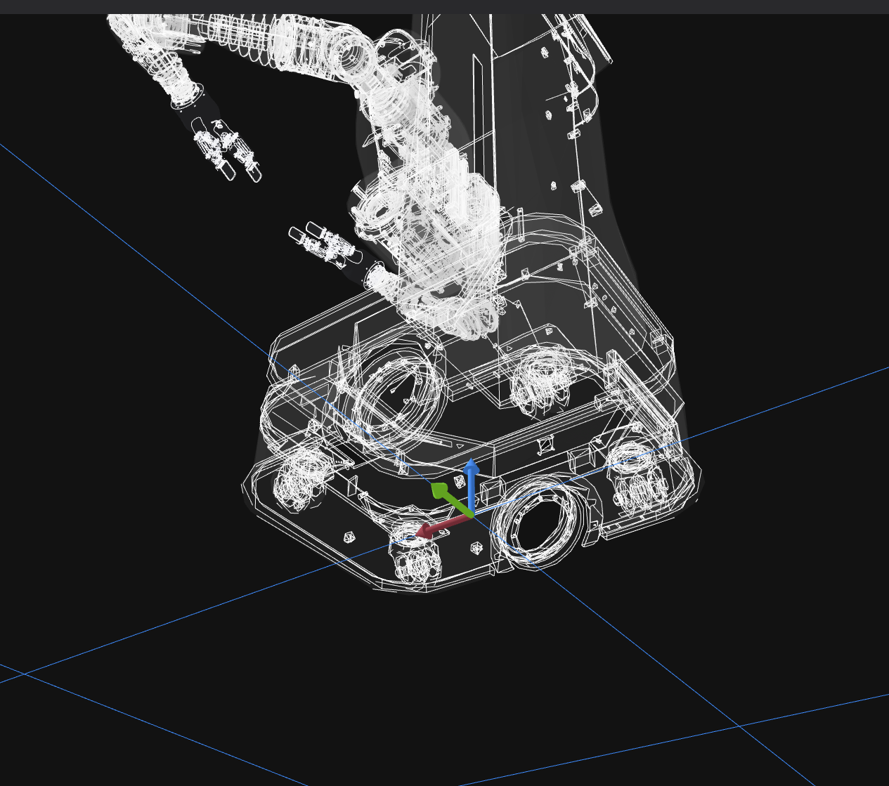
  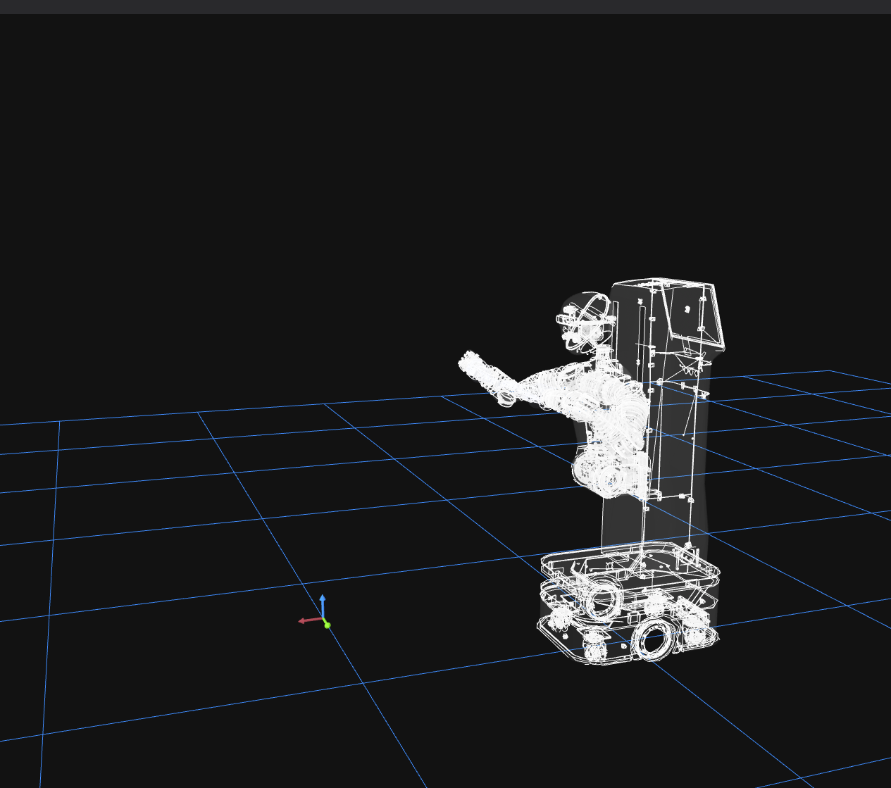
</div>
<div class="image-note">这两张图都是 world 的可能来源：左侧来自地面/接地点，右侧来自基站或第三方相机。</div>

</div>
</div>

<!--
简单说一下目前我们有使用到两种坐标系
- baselink坐标系就是基于在urdf中定义的baselink这个部件的坐标系, baselink对于轮臂机器人来说通常在底盘. 对于有双腿的机器人baselink通常在身体中央
- baselink的优势(容易获取end pose)
- 世界坐标系就是一个独立于机器人urdf结构的一个第三方的坐标系
- 世界坐标系的优势(在后续采集需要机器人本体移动的数据的时候, 可以保证目标相对坐标系静止, 只有机器人在运动. 并且就算是在机器人静止的数采任务下, 也可以避免机器人本体的抖动对目标相对坐标系的抖动) (还有就是如果可以采集到多个机器人在统一的一个世界坐标系下的end pose, 就可以采集多个机器人共同处理一个任务的数据)
- 世界坐标系的问题(世界坐标系下的end pose会比较难以获取, 可靠的世界坐标系下的数据通常需要额外的硬件)
- 简单介绍两种常见的获取世界坐标系的方案,(第一类依赖准确的urdf结构以及机器人腿部的关节数据, 使用地面作为世界坐标系)(第二类需要外部设备, 摄像头, 第三方基站)
-->

---
class: compact-business raw-end-mismatch-slide
---

<div class="doc-section">04 · Raw End 校验</div>

# DWHEEL：为什么 Raw End 需要统一坐标系

<div class="doc-columns equal">
<div>

部分构型的厂商 Raw End 并不是相对统一的 `base_link` 表达。DWHEEL 是一个例子：厂商给出的两个手的 Raw End 坐标系定义在两侧肩膀附近，而不是地盘上的 `base_link`。

| 检查项 | DWHEEL 例子 | 处理原则 |
|---|---|---|
| reference frame | 左/右肩膀附近 frame | 先归一化到统一 `base_link` |
| endpoint | 厂商控制系统定义 | 对齐到明确的手部/工具点 |
| 是否可比较 | 不能直接与 FK End 比较 | 先校验语义，再比较数值 |

这页的重点不是 DWHEEL 本身，而是说明 Raw End 进入数据流程后不能直接信任：坐标系、endpoint 和姿态约定都需要被校验。

</div>
<div>

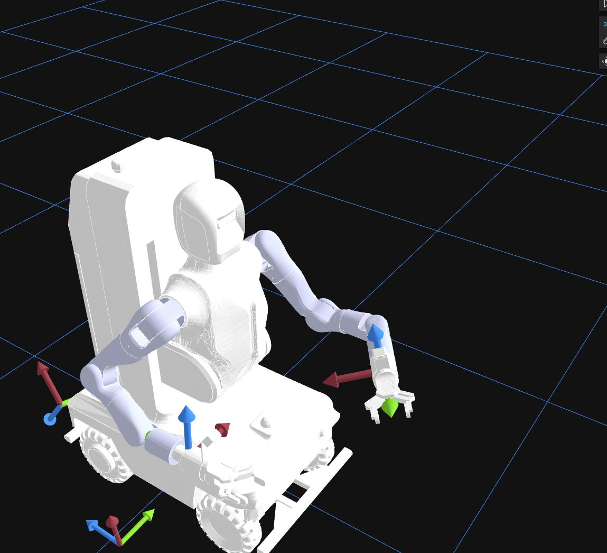
<div class="image-note">DWHEEL 的厂商 Raw End 使用肩部附近参考系；统一处理时需要回到地盘 <code>base_link</code> 或明确记录其真实 frame。</div>

</div>
</div>

<!--
这里是一个坐标系定义我我们不一致的例子
- dhweel的坐标系使用的不是baselink, 因此如果我们把它提供的raw_end数据当作baselink坐标系下的数据使用, 就会出现这样的错位.
- 因此对于这种情况, 必须要搞清楚厂商对于他们底层数采返回的raw_end数据的坐标系定义是什么.
-->

---
class: compact-business end-types-slide
---

<div class="doc-section">05 · End 类型</div>

# Action End、State End、Raw End 与 Verify End

<div class="doc-columns equal">
<div>

| 名称 | 含义 |
|---|---|
| Action End | 控制指令对应的目标末端位姿 |
| State End | 实际关节反馈对应的末端位姿 |
| Raw End | 厂商或外部系统直接给出的末端位姿 |
| Verify End | 用 joint values + URDF/FK 计算出的末端位姿 |
| TCP End | 在 reference end 基础上叠加固定标定偏移后的工具中心点 |

这些名字不是五个物理末端，而是从“数据来源、时间语义、endpoint 语义”三个维度组合出来的结果。

</div>
<div>

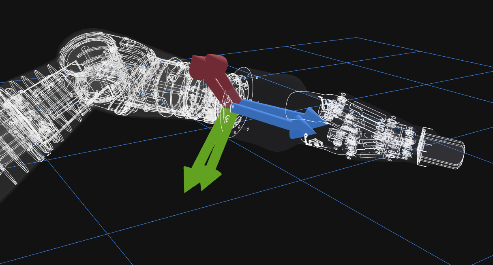
<div class="image-note">Action/State 在运动中可能因为控制延迟或 timestamp 未对齐而错位。</div>

<div class="takeaway"><strong>比较原则：</strong>Raw 与 Verify 不一致，不等于 FK 一定错。先确认 endpoint、frame、timestamp、单位和 quaternion 顺序。</div>

</div>
</div>

<!--
讲解目前会保存在h5中的几种end
- 这里实际保存的其实是raw verify tcp, action和 state只是分类
- 通常action 和state end会在关节运动的时候出现一些偏移, 这是正常情况
-->

---
class: compact-business tcp-end-slide
---

<div class="doc-section">06 · TCP End</div>

# TCP End：从参考末端到真实工具点

<div class="doc-columns equal">
<div>

```python
# 参考末端：由 FK 计算
T_base_reference = forward_kinematics(
    chain, state_joint_values)

# TCP：叠加固定标定偏移
T_base_tcp = (
    T_base_reference @ T_reference_tcp)
```

| 变换 | 含义 |
|---|---|
| `T_base_reference` | FK 算出的参考末端，例如 `left_base_link` |
| `T_reference_tcp` | 标定得到的固定偏移 |
| `T_base_tcp` | 真实工具中心点相对 `base_link` 的位姿 |

在人形机器人领域，`tcp_end` 还没有完全统一的行业定义。这里采用的是数据处理中的约定：从一个明确的 reference end 出发，再叠加工具中心点的固定标定偏移。

TCP 的误差里可能包含工具安装、夹爪几何和标定偏差，不能直接全部解释为 FK 错误。

</div>
<div>

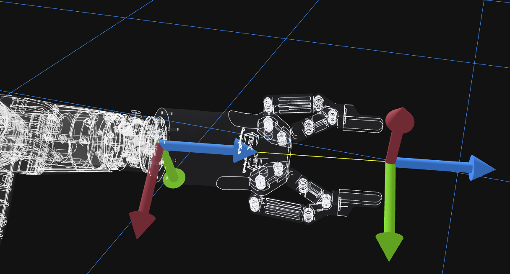
<div class="image-note">示例：TCP 可以由 effector 的 base link 经过固定平移/旋转得到。</div>

</div>
</div>

<!--
tcp end就是 tool control end, 代表夹爪实际抓握时和物体接触的位置, 通常就在夹爪的中心, 我这里的图片可能有点问题.
- 这个概念过去主要被应用于工业机械臂领域, 因此可以比较好的被使用在夹爪上, 但是对于灵巧手, 目前没有行业统一的对tcp的定义.
- 对于夹爪, 计算方式其实就是设定一个固定的相对夹爪的baselink(通常就是最后一个手腕的link)的坐标系的一个变换, 这里的变换通常只需要沿着一个轴线平移. 然后就可以获得tcp end
-->

---
class: module-divider
---

<div class="module-kicker">MODULE 03</div>

# FK

<div class="module-summary">
FK 回答“给定一组关节值，末端在哪里”：它把关节空间中的角度或位移，映射成笛卡尔空间中的 End Pose。
</div>

---
class: lecture-slide kinematics-slide
---

<div class="doc-section">01 · 机器人运动学</div>

# 什么是机器人运动学？

<div class="definition"><strong>通用定义</strong>　机器人运动学研究机器人几何结构、关节运动与末端执行器在空间中的位置和姿态之间的关系，而不考虑引起运动的力或力矩。</div>

<div class="doc-columns equal">
<div>

## 两个空间

| 空间 | 在数据中的样子 |
|---|---|
| 关节空间 Joint Space | H5 / rosbag 中的关节角度或位移 |
| 笛卡尔空间 Cartesian Space | End 的 `position` 和 `orientation` |

正运动学就是从关节空间到笛卡尔空间的映射：给机器人一组关节状态，计算它的“手”会伸到哪里、朝向哪里。

</div>
<div>

## 两个基本问题

| 对比维度 | 正运动学 FK | 逆运动学 IK |
|---|---|---|
| 输入 | 各个关节变量 | 末端目标位姿 |
| 输出 | 末端位置和姿态 | 各个关节变量 |
| 复杂度 | 按链路累乘，相对直接 | 可能无解、多解或无穷解 |
| 用途 | 状态计算、轨迹仿真、数据校验 | 路径规划、任务控制 |

</div>
</div>

<div class="takeaway"><strong>本文主线：</strong><code>joint_values + URDF chain → End Pose</code>。IK 只作为对比概念，不展开求解算法。</div>

<!--
- 正运动学fk就是使用关节角度值和urdf的定义求当前关节角会达到的末端位姿, 正运动学是可以求出唯一解的
- 逆运动学ik就是使用末端位姿和urdf的定义求可以达到当前末端位姿需要的每个关节的关节角. 这里没有唯一解
- 我们这里主要使用的是正运动学
-->

---
class: lecture-slide matrix-slide code-matrix-slide
---

<div class="doc-section">02 · 齐次变换</div>

# 齐次变换矩阵：用代码读懂一个 4×4

<div class="doc-columns code-wide">
<div>

```python
T = np.array([
    # 左上 3x3 是旋转，右侧一列是位置
    [r00, r01, r02, px],
    [r10, r11, r12, py],
    [r20, r21, r22, pz],
    [0.0, 0.0, 0.0, 1.0],
])
```

| 区域 | 代码切片 | 含义 |
|---|---|---|
| 左上 3×3 | `T[:3, :3]` | 旋转矩阵 `R`，表示当前 frame 的朝向 |
| 右侧 3×1 | `T[:3, 3]` | 坐标 `p`，表示当前 frame 原点在哪里 |
| 最后一行 | `T[3, :]` | 齐次矩阵的固定补位 |

</div>
<div>

## 为什么用 `@`

```python
T_base_elbow = T_base_shoulder @ T_shoulder_elbow
T_base_wrist = T_base_elbow @ T_elbow_wrist
T_base_end = T_base_wrist @ T_wrist_end

position = T_base_end[:3, 3]
rotation = T_base_end[:3, :3]
orientation = matrix_to_quaternion(rotation)
```

矩阵乘法的顺序表达了 frame 的方向：左边是已经累计到 base 的结果，右边是下一段 parent→child 变换。

</div>
</div>

<!--
这里讲一下fk的计算方式, 首先对于urdf中两个link之间的变换关系, 可以使用一个齐次变换矩阵来表达, 结构是一个4*4的矩阵
- 矩阵中的左上角的3*3其实就是旋转矩阵, 可以从我们h5里面的四元数或者rpy值来转换得到
- 右侧的1*3的部分就是坐标, 也就是xyz

- 这些变换矩阵可以直接使用矩阵成分相乘, 其中成分的左侧就是过去从baselink开始一级一级乘上来的总的变换, 然后右边是现在要乘上去的最新的一级变换(可以参考这里的代码)
-->

---
class: lecture-slide dh-code-slide
---

<div class="doc-section">03 · DH 参数</div>

# DH 参数：标准化的建模语言

<div class="doc-columns code-wide">
<div>

Denavit-Hartenberg 参数法用四个参数描述相邻连杆坐标系之间的关系。

| DH 参数 | 含义 | 描述 |
|---|---|---|
| `a` | 连杆长度 | 两个相邻关节轴线之间的公法线距离 |
| `alpha` | 连杆扭角 | 两个相邻关节轴线之间的夹角 |
| `d` | 连杆偏移 | 沿关节轴线的距离 |
| `theta` | 关节角度 | 绕关节轴线的旋转角度 |

DH 和 URDF-FK 的共同点：每一段生成一个 4×4 变换矩阵，然后按顺序连乘。

</div>
<div>

```python
import numpy as np

def dh_transform(a, alpha, d, theta):
    # 先缓存三角函数，矩阵里会重复使用
    ct = np.cos(theta)
    st = np.sin(theta)
    ca = np.cos(alpha)
    sa = np.sin(alpha)

    return np.array([
        [ct, -st * ca,  st * sa, a * ct],
        [st,  ct * ca, -ct * sa, a * st],
        [0,        sa,       ca,      d],
        [0,         0,        0,      1],
    ])

T_base_end = T1 @ T2 @ T3
```

</div>
</div>

<div class="takeaway"><strong>取舍：</strong>DH 很适合讲“参数表 + 变换矩阵 + 连乘”；实际处理 A2D 这类数据时，直接解析 URDF 更贴近现有文件和 TF 可视化。</div>

<!--
这里是构造一个变换矩阵的方法, 实际上这些参数都可以使用urdf中的定义计算获取
-->

---
class: lecture-slide urdf-transform-example-slide
---

<div class="doc-section">04 · URDF 单段变换</div>

# 从旋转和平移构建一段变换矩阵

<div class="doc-columns code-wide">
<div>

```xml
<!-- child frame 相对 parent frame -->
<origin xyz="0 0.03 0"
        rpy="0 0 1.5708"/>
```

这个例子表示：

| 部分 | 含义 |
|---|---|
| `rpy="0 0 1.5708"` | 绕 Z 轴旋转 90 度 |
| `xyz="0 0.03 0"` | 沿 Y 轴平移 0.03m |

先把旋转写成 3×3 的 `R`，再把平移写到右侧的 `p`，最后补上固定的最后一行。

</div>
<div>

```python
Rz_90 = np.array([
    [0, -1, 0],
    [1,  0, 0],
    [0,  0, 1],
])

p = np.array([0, 0.03, 0])

T_parent_child = np.array([
    [0, -1, 0, 0.00],
    [1,  0, 0, 0.03],
    [0,  0, 1, 0.00],
    [0,  0, 0, 1.00],
])
```

<div class="takeaway"><strong>记法：</strong><code>T[:3, :3] = R</code>，<code>T[:3, 3] = p</code>。旋转负责“朝向”，平移负责“原点在哪里”。</div>

</div>
</div>

<!--
- 这里讲一下怎么从urdf里面的origin构造一个4*4变换矩阵
- 例子里面rpy是0 0 1.5708, 也就是绕z轴转90度
- xyz是0 0.03 0, 也就是沿着y轴移动0.03米
- 先把旋转部分放到矩阵左上角3*3
- 再把平移xyz放到矩阵右边这一列
- 最后一行永远是0 0 0 1, 只是为了让旋转和平移可以放在一个矩阵里面一起相乘
-->

---
class: lecture-slide fk-tree-slide
---

<div class="doc-section">05 · FK Tree</div>

# FK Tree：从 base_link 一层一层走到 End

<div class="tf-tree-full-image">
  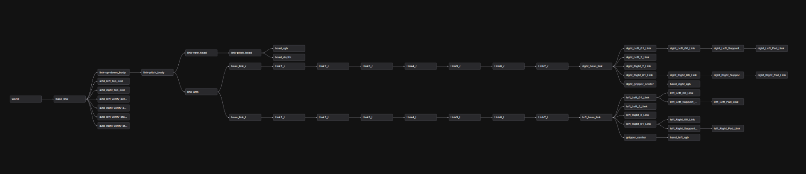
</div>

<div class="takeaway"><strong>计算方向：</strong>从 <code>base_link</code> 出发，按 parent → child 的路径一段一段乘到目标 end。最终矩阵表示的是 end 在 <code>base_link</code> 坐标系下的 pose。</div>

<!--
- 这页单独放tf tree, 主要是为了让大家看到fk不是随便找几个joint相乘
- 必须先在tree里面找到从base_link到目标end的那条路径
- 然后按照parent到child的顺序, 一层一层把每段变换矩阵乘上去
- 乘到最后得到的T_base_end, 就是end在base_link坐标系下面的位置和朝向
-->

---
class: lecture-slide fk-algorithm-slide
---

<div class="doc-section">06 · FK 算法</div>

# 沿 base → end 的运动链累积变换

<div class="doc-columns code-wide">
<div>

```text
base_link
→ ...
→ Link5_l
→ Link6_l
→ Link7_l
→ gripper_center
```

## 计算步骤

1. 从单位矩阵 `np.eye(4)` 开始。
2. 按 base→end 的有序 chain 遍历 joint。
3. 为每个 joint 生成 `T_parent_child`。
4. 每步执行 `T = T @ T_parent_child`。
5. 从最终 `T` 中取 position 和 orientation。

</div>
<div>

```python
def forward_kinematics(chain, joint_values):
    # 从 base frame 开始累计
    T = np.eye(4)
    for joint in chain:
        # 先应用 URDF 中的固定安装变换
        T_parent_child = origin_transform(
            joint.origin_xyz, joint.origin_rpy)
        if joint.type in {"revolute", "continuous"}:
            q = joint_values[joint.name]
            T_parent_child = T_parent_child @ rotation_transform(
                joint.axis, q)
        elif joint.type == "prismatic":
            q = joint_values[joint.name]
            T_parent_child = T_parent_child @ translation_transform(
                joint.axis * q)

        # 累乘下一段 parent -> child
        T = T @ T_parent_child

    # 从最终矩阵取 End Pose
    position = T[:3, 3]
    orientation = matrix_to_quaternion(T[:3, :3])
    return position, orientation
```

</div>
</div>

<!--
- 这里讲一下fk的实际算法, 核心就是从base开始, 沿着urdf里面的chain一段一段往end乘
- 每一段joint都会先生成一个parent到child的变换矩阵, 这个矩阵里面同时包含旋转和平移两种情况
- 可以结合前面那张tf tree图讲, 从base_link开始, 顺着树上的parent child关系一层一层往目标end走

- 旋转的计算方法比较简单, 如果是固定安装的旋转, 就用urdf里面origin的rpy转成旋转矩阵
- 如果是revolute或者continuous关节, 就拿当前这一帧的关节角q, 绕urdf里面axis写的轴转q这么多
- 所以旋转不是直接加角度, 而是每一段都先变成旋转矩阵, 然后跟前面累计的旋转矩阵相乘

- 平移的计算方法也比较简单, 固定安装的平移就是urdf里面origin的xyz
- 如果是prismatic关节, 就沿着axis方向移动q这么多, 也就是axis乘上q
- 这里需要注意, 本地坐标系里的平移会被前面已经累计出来的旋转带着一起转过去, 所以不能只把所有xyz简单相加

- 最后乘完以后, T右边这一列就是end的位置, T左上角3*3就是end的朝向
- 这两个合起来, 就是end在base_link坐标系下面的pose
- 最后再提醒一下, 真正容易错的是joint名称和顺序, 单位和正负号, 还有end和frame是不是同一个定义
-->
